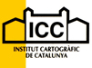
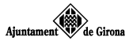
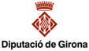

# 1as Jornadas de SIG libre (2007)

5, 6 y 7 de marzo de 2007

Sesión inaugural
==================

* **Joaquim Majó** (Vicerector de Desenvolupament Tecnològic i Gestió del Coneixement).

* **Irene Compte** (Directora del SIGTE).

* **Malcom Bain** (Abogado, Consultor de la UOC), **David Megías** (Director del Master Oficial en Software Libre de la UOC).

* **Antoni Perez** (Profesor de la UOC).

Ponencias plenarias
====================

* **Factores multiplicativos: ejemplos de los sectores académico y industrial** (**Michael Gould**, Profesor de la Universidad Jaume I, Departamento de Lenguajes y Sistemas Informáticos).

* **Arquitectura corporativa apoyada en SIG Libre y Estándares** (**Álvaro Zabala**, Fundador de AGILES.ORG).

* **SAGA: System for Automated Geographical Analysis** (**Victor Olaya**, Equipo de desarrolladores de SAGA).

* **Cumpliendo el sueño de la Interoperabilidad** (**Gabriel Roldán**, Fundador de Axios Engineering).

* **gvSIG: la aplicación integral para el manejo de información geográfica** (**Álvaro Anguix**, Director comercial del área de I+D+i de IVER).

* **Software libre y sistemas de información geográfica: conceptos, definiciones y aspectos legales** (**Malcom Bain** (Abogado, Consultor de la UOC), **David Megías** (Director del Master Oficial en Software Libre de la UOC), **Antoni Perez** (Profesor de la UOC)).

Comunicaciones
=================

Aplicaciones (desarrollos)
---------------------------

* **[SIGUA: Sig Libre para la gestión del suelo de la Universidad de Alicante](http://dugi.udg.edu/item/http:@@@@hdl.handle.net@@10256@@1194)** (José Manuel Mira, José Tomás Navarro, Alfredo Ramón).

* **[d-Ruta: Un sistema móvil de información turística](https://dugi-doc.udg.edu/handle/10256/1196)** (Josep Molina).

* **[Wikiloc: Software Libre APIs de Google Maps para visualizar y compartir rutas GPS](https://dugi-doc.udg.edu/handle/10256/1197)** (Jordi Ramot).

* **[Alguneos desarrollos basados en JUMP para el apoyo logístico y control de la calidad en las operaciones de recogida de información estadística](https://dugi-doc.udg.edu/handle/10256/1201)** (Eduard Suñé Luis).

* **[Proyecto Ramón Llull: Sistema de gestión de alteraciones catastrales para las notarías de la Comunidad Valenciana](https://dugi-doc.udg.edu/handle/10256/1202)** (Fernando Llorens, José Tomás Navarro, José Manuel Mira, Alfredo Ramón Morte).

* **[WxGRASS: Una Interfaz Gráfica de Usuario para la integración de diversos programas libres para SIG](https://dugi-doc.udg.edu/handle/10256/1206)** (Francisco Alonso Sarría, José Antonio Palazón).

* **[SIGFRUT: Aplicación web para el diseño de instalaciones y aplicaciones agrícolas](https://dugi-doc.udg.edu/handle/10256/1207)** (Francesco Marucci, Ferran Orduña, Toni Hernández).

* **[SigWeb 2.0: Ajax + OpenToro](https://dugi-doc.udg.edu/handle/10256/1208)** (Moisés D. Díaz, Vitalino Lázaro, Marcos Velasco, Ángel Domínguez).

* **[Kosmo como alternativa abierta de los Sistemas de Información Geográfica](https://dugi-doc.udg.edu/handle/10256/1209)** (Glesni Hidalgo).

* **[Introducción a los conceptos y a la utilización del SIG Open-Source GRASS](https://dugi-doc.udg.edu/handle/10256/1214)** (Eve Rousseau).

* **[Ampliación de las capacidades de visualización de un SIG libre mediante la comunicación con un navegador 3D](https://dugi-doc.udg.edu/handle/10256/1215)** (Alberto Varela, Javier Taibo, Luis A. Hernández, Antoni Seoane).

* **[Panorama actual del ecosistema de software libre para SIG](http://diobma.udg.edu//handle/10256.1/516)** (Miguel MOntesinos, Jorge Gaspar Sanz).

* **[Arquitectura SOA para la integración entre Software Libre y software propietario en entornos mixtos](https://dugi-doc.udg.edu/handle/10256/1217)** (Alejandro Guinea, Sergio Jorrín).

* **[Software para la manipulación de bases de datos espaciales PostGIS](https://dugi-doc.udg.edu/handle/10256/1225)** (A. Baksai, Mariela Gutiérrez).

* **[jCRS: Extensión de gvSIG para la gestión de Sistemas de Referencia de Coordenadas](https://dugi-doc.udg.edu/handle/10256/1227)** (Francisco Javier González, Luís W. Sevilla, David Hernández).

* **[Sistemas de apoyo a la Gestión de Servicios Urbanos, basados en Software Libre](https://dugi-doc.udg.edu/handle/10256/1229)** (José Javier García).

* **[HidroSIG: Un Sistema de Información Geográfica para la gestión de recursos naturales y modelación del medio ambiente](https://dugi-doc.udg.edu/handle/10256/1231)** (Jaime I. Vélez, Oscar J. Mesa, Oliver O. Hernández, Oscar D. Álvarez, Elisabeth C. Zapata, Jesús D. Gómez, Oscar Correa, Germán Poveda, Felipe Quintero, Jorge M. Ramírez, Andrés D. Acero, Jorge E. Alarcón, María C. Gómez).

Aplicaciones temáticas
------------------------

* **[Las herramientas SIG Libre en la investigación histórica](https://dugi-doc.udg.edu/handle/10256/1198)** (Xavier Rubio).

* **[Migración a SIG Libre del catálogo de caminos rurales y pistas forestales de Extremadura](https://dugi-doc.udg.edu/handle/10256/1199)** (Manuel de la Calle, Rocío Blas, P. Berrocal, Luís Miguel Cabezas, Vidal Toboso, Javier Corbacho, P. Muñoz).

* **[Creación de Modelos Digitales de Elevaciones a partir de diferentes métodos de interpolación para la determinación de redes de drenaje](https://dugi-doc.udg.edu/handle/10256/1200)** (Juan Manuel Quiñonero, Francisco Alonso Sarría).

* **[LiDAR data filtering with GRASS GIS for the determination of digital terrain models](https://dugi-doc.udg.edu/handle/10256/1203)** (Roberto Antolín, Maria A. Brovelli).

* **[Desarrollo de una herramienta de Código Abierto para la Gestión de espacios en la Universidad](https://dugi-doc.udg.edu/handle/10256/1204)** (C. Rodríguez, Miguel Cordero, Rafael Crecente, Marcos Boullón, Diego Miranda).

* **[Uso de R y GRASS para la obtención de mapas de disponibilidad de hábitat mediante análisis factorial de nicho](https://dugi-doc.udg.edu/handle/10256/1210)** (José Antonio Palazón, Francisco Alonso).

* **[Socioecología de los paisajes holocénicos en el Valle del Serpis](https://dugi-doc.udg.edu/handle/10256/1211)** (Agustín Díez, C. Michael Barton, Joan Bernabeu, Neus La Roca).

* **[VisGeo: una herramienta para la visualización geográfica](https://dugi-doc.udg.edu/handle/10256/1212)** (Joaquín Bosque Sendra, Hernán Zamora).

* **[LOCALIZA: una herramienta SIG para resolver problemas de localización óptima](https://dugi-doc.udg.edu/handle/10256/1213)** (Joaquín Bosque Sendra, M. Gómez, Francisco Palm Rojas).

IMs - IDEs
-----------

* **[Un servidor de mapas OpenSource para la gestión sanitaria: Atlas electrónico de salud de Catalunya](https://dugi-doc.udg.edu/handle/10256/1218)** (David Comas, Fernando Marín, Miquel Olivet).

* **[Adaptaciones de Geonetwork para la construcción de IDE sectoriales](https://dugi-doc.udg.edu/handle/10256/1221)** (Víctor Pascual Ayats).

* **[MonoGIS, un servidor de mapas para la Administración Pública](https://dugi-doc.udg.edu/handle/10256/1222)** (Michael Paul, Pere Mitjans).

* **Spatial Data Infrastructure for watershed modelling and making decision**.

* **Transition between metadata models: approach based on the use Open Source software**.

* **[Sistema de Información Geográfica accesible](https://dugi-doc.udg.edu/handle/10256/1228)** (Damián Serrano, José Vargas, Eduardo Venegas).

* **[Ruteador inteligente y dinámico basado en la clasificación del tráfico en tres niveles](https://dugi-doc.udg.edu/handle/10256/1230)** (Daniel Gorni).

* **[Plataforma redGIS.NET para el acceso a datos y funciones geográficas](https://dugi-doc.udg.edu/handle/10256/1232)** (José Manuel Mira, Fernando Llorens, Alfredo Ramón, José Tomás Navarro).

* **Sistema de Información Geográfica para Web con informaciones espaciales (geográficas) de output y input para expediciones**.

* **[Ka-map: an interactive web-mapping application](https://dugi-doc.udg.edu/handle/10256/1234)** (Lorenzo Becchi).

Talleres
========

* **Taller 1:** *Geoserver como base de una IDE basada en Software Libre* (Gabriel Roldán - Axios Engineering).

* **Taller 2:** *Trabajando con gvSIG* (Álvaro Anguix - Director comercial del área de I+D+i de IVER).

* **Taller 3:** *Trabajando con SAGA* (Víctor Olaya - Equipo de desarrolladores SAGA).

* **Taller 4:** *Desarrollado de Aplicaciones con PostGRE SQL + PostGis* (Marc Compte - SIGTE).

Patrocinadores
==============

