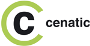
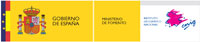
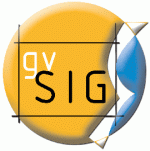
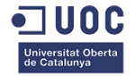
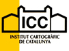
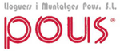

# 2as Jornadas de SIG libre (2008)

3, 4, 5 de marzo de 2008

Contenido de las Jornadas de SIG Libre 2017

Ponencias plenarias
====================

* **The concept of ‘mentorship’ in the geospatial realm** (**Tyler Mitchell**, Director Ejecutivo de la Open Source Geospatial Foundation, OSGeo). **[Vídeo](http://diobma.udg.edu/handle/10256.1/512)**

* **Un modelo para evaluar el futuro de Proyectos Open Source** (**Alberto Abella**, Ingeniero superior de telecomunicaciones por la ETSIT de Madrid). **[Presentación](https://dugi-doc.udg.edu/handle/10256/1107)** | **[Vídeo](http://diobma.udg.edu/handle/10256.1/513)**

* **Arquitectura SIG corporativa apoyada en Software Libre y Estándares** (**Alvaro Zabala**, Junta de Andalucía. Fundador de AGILES.ORG). **[Presentación](https://dugi-doc.udg.edu/handle/10256/1108)** | **[Vídeo](http://diobma.udg.edu/handle/10256.1/514)**
 
* **El Proyecto IDEE y el SIG Libre: contactos y sinergias** (**Antonio F. Rodríguez Pascua**, Responsable del Proyecto IDEE en el IGN). **[Presentación](https://dugi-doc.udg.edu/handle/10256/1154)** | **[Vídeo](http://diobma.udg.edu/handle/10256.1/515)**

* **Panorama actual del ecosistema de Software Libre para SIG** (**Miguel Montesinos**, Ingeniero de Telecomunicación por la Universidad Politécnica de Valencia; **Jorge Gaspar Sanz**, Ingeniero Técnico en Topografía y Ingeniero en Geodesia y Topografía). **[Presentación](https://dugi-doc.udg.edu/handle/10256/1109)** | **[Vídeo](http://diobma.udg.edu/handle/10256.1/516)**

* **The OpenStreetMap Initiative** (**Steve Coast**, Fundador de la Iniciativa Open StreetMap). **[Vídeo](http://diobma.udg.edu/handle/10256.1/517)**

Comunicaciones
=================

* **Componentes y extensiones para sistemas de ayuda a la decisión espacial: un enfoque desde Python** (Francisco Palm, Joaquín Bosque).  

* **Potencialidades  del  SIG  Libre  en  la  educación universitaria.  La  enseñanza  de  SIG  en  Geografía. Universidad de Extremadura** (Rocío Blas, J.Corbacho). **[Presentación](https://dugi-doc.udg.edu/handle/10256/1163)** 

* **Edición cartográfica vectorial en un sistema web** (José Javier García).**[Presentación](https://dugi-doc.udg.edu/handle/10256/1164)** 

* **Uso  de  Comet  (Reverse  AJAX)  en  los  SIG.  Prototipo  de  SIG colaborativo** (Diego Gómez, Manuel de la Calle, Vidal Toboso, Raquel Martínez). **[Presentación](https://dugi-doc.udg.edu/handle/10256/1155)**

* **gvSIG  Mobile.  Cliente  GIS/IDE  móvil** (Miguel  Montesinos,  Javier Carrasco). **[Vídeo](http://diobma.udg.edu/handle/10256.1/520)** 

* **OpenLayers** (Lorenzo Becchi). **[Presentación](https://dugi-doc.udg.edu/handle/10256/1111)** | **[Vídeo](http://diobma.udg.edu/handle/10256.1/521)** 

IDE - Metadatos
--------------

* **Implantación de una IDE y de una herramienta para la gestión municipal en los ayuntamientos de la Comunitat Valenciana** (Alvaro Anguix, José Miguel Rosa, Martín García). **[Presentación](https://dugi-doc.udg.edu/handle/10256/1157)** | **[Vídeo](http://diobma.udg.edu/handle/10256.1/523)** 

* **Migración  del  SIG  Libre  de  la  Diputación  de  A  Coruña** (Pedro González y otros). **[Presentación](https://dugi-doc.udg.edu/handle/10256/1158)** | **[Vídeo](http://diobma.udg.edu/handle/10256.1/524)**

* **Extracción  semiautomática  de  metadatos:  hacia  los metadatos implícitos** (M.Gould, L.Díaz, C.Granell, A.Beltrán, A.Llaves). **[Presentación](https://dugi-doc.udg.edu/handle/10256/1160)** | **[Vídeo](http://diobma.udg.edu/handle/10256.1/525)**

* **SIG e IDE del Cabildo Insular de la Palma: una propuesta tecnológica  orientada  al  software  libre** (Juan  Bermejo, Alvaro Anguix). **[Presentación](https://dugi-doc.udg.edu/handle/10256/1112)** | **[Vídeo](http://diobma.udg.edu/handle/10256.1/526)**

* **Una  estructura  de  indexación  para  la  recuperación  de documentos con referencias geográficas** (Miguel Luaces, José R. Paramá, Oscar Pedreira, Diego Seco). 

* **Implantación de una IDE costera y portuaria y desarrollo de un cliente SIG para su mantenimiento y gestión** (Laura Díaz, Ricardo Insa, Alvaro Anguix, Fernando Sánchez). **[Presentación](https://dugi-doc.udg.edu/handle/10256/1114)** | **[Vídeo](http://diobma.udg.edu/handle/10256.1/539)**

* **PDVSA  -  Exploración  a  gvSIG** (Sylvia  Rojas,  Yngrid Oropeza). **[Presentación](https://dugi-doc.udg.edu/handle/10256/1179)** 

Programario - Desarrollos
---------------------------

* **GRASS goes web and embrio** (Lorenzo Becchi). **[Presentación](https://dugi-doc.udg.edu/handle/10256/1139)** 

* **Estudio  comparativo  entre  SIG  propietario  y  SIG  libre** (Juan Ramón Mesa). **[Presentación](https://dugi-doc.udg.edu/handle/10256/1165)** 

* **gvSIG: Informe de estado** (Alvaro Anguix). **[Presentación](https://dugi-doc.udg.edu/handle/10256/1140)** 

* **Estudio  comparativo  de  herramientas  SIG  Libres  aplicadas  a contextos de cooperación** (Càrol Puig, Júlia Gilavert). **[Presentación](https://dugi-doc.udg.edu/handle/10256/1166)** 

* **SPIP GIS** (Horacio González). **[Presentación](https://dugi-doc.udg.edu/handle/10256/1167)**

* **Kosmo  -  Plataforma  SIG  Libre  corporativa** (Antonio  Muñoz, C.Navarro, E.Ramírez). **[Presentación](https://dugi-doc.udg.edu/handle/10256/1168)** 

* **Humboldt - Geopista Viewer** (J. Elía y otros autores). 

Aplicaciones
----------------

* **Extracción y aprovechamiento de la información geográfica puntual de un catálogo visual de carreteras** (Fco. Alberto Varela, Juan Ignacio Varela, Sabela Lorenzo).**[Presentación](https://dugi-doc.udg.edu/handle/10256/1181)** 

* **Aplicación para la ayuda a la planificación de extinción de incendios forestales basada en software libre** (J.Vicedo, J.Linares, D.Cuesta, A.Molina). **[Presentación](https://dugi-doc.udg.edu/handle/10256/1182)**

* **Migración a Software Libre de la Plataforma Geomática de CVG Edelca** (Francisco Palm). **[Presentación](https://dugi-doc.udg.edu/handle/10256/1182)** 

* **Distribution  of  Amazon  Forest  Biodiversity  Georreferenced Information using free software** (Felipe dos Santos Costa, Sylvain Jean Marie Desmoulière). 

* **Proyecto  GISIGNET  de  gestión  e  inventario  de  red  de telecomunicaciones con SIG** (Santiago Payà). 

Servidores de Mapas - Otros
----------------

* **Desarrollo  de  una  geoplataforma  cibertaxonómica europea** (Miguel Jorge Lobo, Pere Roca, Pablo Sastre). **[Presentación](https://dugi-doc.udg.edu/handle/10256/1115)** | **[Vídeo](http://diobma.udg.edu/handle/10256.1/540)**

* **SIG  Libres  para  la  gestión  de  territorios  rurales  en Extremadura** (Ana Nieto, Rocío Blas). **[Presentación](https://dugi-doc.udg.edu/handle/10256/1116)** | **[Vídeo](http://diobma.udg.edu/handle/10256.1/541)**

* **Geovisor  del  Port  de  Barcelona** (Enric  Rodelles,  Lluís Tartera). 

* **El sistema defensivo de Villasviejas de Tamuja (Botija, Cáceres): una aplicación de software libre en el análisis de paisajes arqueológicos** (Rebeca Cazorla, Enrique Cerrillo, Victorino Mayoral, José Ángel Salgado). **[Presentación](https://dugi-doc.udg.edu/handle/10256/1138)** | **[Vídeo](http://diobma.udg.edu/handle/10256.1/544)**

* **El SIG en las aplicaciones arqueológicas** (Vitor M. Cabral). 
Mesas de debate
----------------

* **Implementación del SIG Libre: Cómo facilitar y promover el SIG Libre en la Universidad, en la Administración y en la Empresa Privada**. **[Vídeo](http://diobma.udg.edu/handle/10256.1/522)**

* **Software Libre y Proyectos de Colaboración**.

Sesiones especiales
----------------

* **El Capítulo Local OSGeo para la comunidad hispano-hablante** (Jorge G. Sanz, Victor Olaya, Lorenzo Becchi). **[Presentación](https://dugi-doc.udg.edu/handle/10256/1117)** | **[Vídeo](http://diobma.udg.edu/handle/10256.1/542)**

