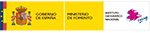
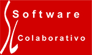

# 3as Jornadas de SIG libre (2009)

Las Jornadas de SIG Libre a Girona nacen con el objetivo de responder a la realidad de los SIG Libre en España, concepto entendido como la democratización del acceso a la tecnología de los Sistemas de Información Geográfica.
La principal motivación de las primeras Jornadas era crear un espacio para dar a conocer esta nueva realidad y establecer un punto de encuentro para una Comunidad, la de los usuarios de SIG, creando un espacio donde poder compartir e intercambiar experiencias y conocimientos, además de crear un ambiente de debate que ejemplificara la salud y el vigor del software SIG Libre en España y en países de habla hispana.

* 11, 12 y 13 de marzo de 2009

Ponencias plenarias
====================

* **El Futuro de la Información, más allá de Google** (**Alfons Cornellà**, Presidente de Infonomia).  **[Vídeo](http://diobma.udg.edu/handle/10256.1/1017)**
* **Mainstreaming Sensor Web Enablement Technologies through Collaboration’** (**Simon Jirka**, 52º North Initiative for Geospatial Open Source Software). **[Vídeo](http://diobma.udg.edu/handle/10256.1/1018)**
* **La licencia GPLv3 en el contexto de los SIG** (**Malcolm Bain**, ID Law Partners). **[Vídeo](http://diobma.udg.edu/handle/10256.1/1019)**
* **OpenGeo: a dot-org to build The Open Geospatial Web** (**Chris Holmes**, Managing Dtor The Open Planning Project y presidente OpenGeo). **[Vídeo](http://diobma.udg.edu/handle/10256.1/1020)**
* **To be or not to be. I’m not** (**Enric Rodellas**, Autoritat Portuària de Barcelona, APB). **[Presentación](https://dugi-doc.udg.edu/handle/10256/1349)** | **[Vídeo](http://diobma.udg.edu/handle/10256.1/1021)**
* **El peligro de las patentes de Software’**, **Richard M.Stallman**. **[Vídeo](http://diobma.udg.edu/handle/10256.1/1040)**

Comunicaciones
=================

Sesión A
---------------------------

* **La Comunidad geoespacial y el acceso a los datos oceanográficos** **[Presentación](https://dugi-doc.udg.edu/handle/10256/1350)** | **[Vídeo](http://diobma.udg.edu/handle/10256.1/1023)**
* **Liberación de datos y publicación de recursos geográficos** **[Presentación](https://dugi-doc.udg.edu/handle/10256/1370)** | **[Vídeo](http://diobma.udg.edu/handle/10256.1/1026)**
* **gvSIG: Descentralización y organización de la comunidad** **[Presentación](https://dugi-doc.udg.edu/handle/10256/1373)** | **[Vídeo](http://diobma.udg.edu/handle/10256.1/1027)**
* **Estructura del servidor interactivo de información epidemiológica** **[Presentación](https://dugi-doc.udg.edu/handle/10256/1376)**
* **Servicios Web con funcionalidad geográfica como herramienta para para el análisis y generación de información estratégica en las organizaciones**
* **MapFish - WebGIS 2.0 development framework based on GeoExt and OpenLayers** **[Presentación](https://dugi-doc.udg.edu/handle/10256/1386)**
* **Vissir2: Evolución del visor web del ICC hacia tecnologías abiertas** **[Presentación](https://dugi-doc.udg.edu/handle/10256/1388)**
* **Sistema de geocodificación libre: Callejero Digital de Andalucía** **[Presentación](https://dugi-doc.udg.edu/handle/10256/1400)**
* **Gestor de contenidos del geoportal de la IDE del Cabildo Insular de La Palma** **[Presentación](https://dugi-doc.udg.edu/handle/10256/1407)**
* **Cuadro de mando de la Diputación de Badajoz: Un mundo conectado para la toma de decisiones** **[Presentación](https://dugi-doc.udg.edu/handle/10256/1403)**
* **El Capítulo Local OSGeo para la comunidad hispano-hablante**
* **Implementación de una IDE local en el Centro Histórico de La Habana basada en software libre y aplicaciones de código abierto**

Sesión B
---------------------------
* **SDIAnalyzer: Una aplicación para el estudio de IDE** **[Presentación](https://dugi-doc.udg.edu/handle/10256/1351)**
* **Catalog Connector: Un cliente CSW para conectar catálogos de metadatos** **[Presentación](https://dugi-doc.udg.edu/handle/10256/1371)**
* **Interoperabilidad del servicio de nomenclator y catálogo online del Instituto de Cartografía de Andalucía** **[Presentación](https://dugi-doc.udg.edu/handle/10256/1374)**
* **LocalGIS** **[Presentación](https://dugi-doc.udg.edu/handle/10256/1377)** | **[Vídeo](http://diobma.udg.edu/handle/10256.1/1028)**
* **EduSIG: gvSIG aplicado a la enseñanza de la Geografía** **[Presentación](https://dugi-doc.udg.edu/handle/10256/1383)** | **[Vídeo](http://diobma.udg.edu/handle/10256.1/1029)**
* **DielmoOpenLidar: control de calidad de datos LiDAR y generación de productos finales** **[Presentación](https://dugi-doc.udg.edu/handle/10256/1413)** | **[Vídeo](http://diobma.udg.edu/handle/10256.1/1030)**
* **Capaware: Plataforma de desarrollo de software libre para aplicaciones geográficas 3D multicapa** **[Presentación](https://dugi-doc.udg.edu/handle/10256/1389)** | **[Vídeo](http://diobma.udg.edu/handle/10256.1/1031)**
* **gvSIG Mobile: nuevas funcionalidades del SIG Libre para PDA** **[Presentación](https://dugi-doc.udg.edu/handle/10256/1405)** | **[Vídeo](http://diobma.udg.edu/handle/10256.1/1033)**
* **libLocation: Acceso a dispositivos de localización para gvSIG Desktop y Mobile** **[Presentación](https://dugi-doc.udg.edu/handle/10256/1401)** | **[Vídeo](http://diobma.udg.edu/handle/10256.1/1034)**
* **Sextante, la libreria de análisis geoespacial libre: Presente y Futuro** **[Vídeo](http://diobma.udg.edu/handle/10256.1/1035)**
* **Software geoespacial por y para OpenStreetMap** **[Presentación](https://dugi-doc.udg.edu/handle/10256/1409)** | **[Vídeo](http://diobma.udg.edu/handle/10256.1/1036)**
* **Geoprocesamiento con SQL en OrbisGIS** **[Presentación](https://dugi-doc.udg.edu/handle/10256/1412)** | **[Vídeo](http://diobma.udg.edu/handle/10256.1/1037)**
* **Software Libre para alcanzar la colaboración en un SIG Corporativo. El caso de la Confederación Hidrográfica del Duero** **[Presentación](https://dugi-doc.udg.edu/handle/10256/1417)** | **[Vídeo](http://diobma.udg.edu/handle/10256.1/1038)**

Sesión C
---------------------------

* **Aplicación de turismo sobre teléfonos móviles** **[Presentación](https://dugi-doc.udg.edu/handle/10256/1356)**
* **Gestor de colecciones de recursos para gvSIG** **[Presentación](https://dugi-doc.udg.edu/handle/10256/1372)**
* **Un sistema de prospección arqueológica asistida por SIG Libre: diseño, puesta en práctica y perspectivas futuras** **[Presentación](https://dugi-doc.udg.edu/handle/10256/1375)**
* **Cálculo del tiempo de concentración en hidrología con GRASS** **[Presentación](https://dugi-doc.udg.edu/handle/10256/1378)**
* **Implantación de un SIG basado en software libre para el estudio de recursos hídricos y procesos hidrológicos** **[Presentación](https://dugi-doc.udg.edu/handle/10256/1385)**
* **Implementación del modelo hidrológico de Témez para la evaluación de recuros hídricos con GRASS: fase superficial y subterránea** **[Presentación](https://dugi-doc.udg.edu/handle/10256/1387)**
* **Utilización de software libre para el análisis de la evolución de usos del suelo en la cuenca del Segura mediante teledetección** **[Presentación](https://dugi-doc.udg.edu/handle/10256/1398)**
* **Inventario de arquitectura vernácula; una nueva apuesta por el SIG Libre de la Junta de Extremadura** **[Presentación](https://dugi-doc.udg.edu/handle/10256/1406)**
* **Adaptación de SIG Libre para la mejora de rendimiento de tareas cartográficas** **[Presentación](https://dugi-doc.udg.edu/handle/10256/1402)**
* **SIGATEX: Adaptación del SIG de la Consejería de Cultura y Turismo de la Junta de Extremadura** **[Presentación](https://dugi-doc.udg.edu/handle/10256/1404)**
* **GeoNetwork: Metadata catalog implementation in France and Switzerland** **[Presentación](https://dugi-doc.udg.edu/handle/10256/1411)**
* **Panorama actual y papel de los globos virtuales**
* **A multimodal journey planner based on open source software and ‘de facto’ standards**

Talleres
========

* **Taller basado en Quantum GIS** (Carlos Dávila)
* **Taller basado en Kosmo** (SAIG)
* **Taller basado en MapGuide OS** (CSEYS)

* **Taller basado en Geonetwork** (Jeroen Ticheler)
* **Taller basado en OpenLayers** (Lorenzo Becchi)
* **Taller basado en programación sobre gvSIG** (Fran Peñarubia)

Patrocinadores
==============

Colabora
==============

