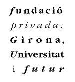
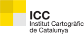
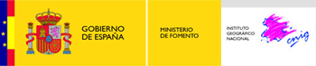
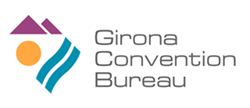

# 5as Jornadas de SIG libre (2011)

Cinco ediciones, cinco años de software libre para SIG en Girona, en casa. Atrás quedan ya cientos de anécdotas, historias, charlas, risas y por delante, un largo viaje por recorrer. Marzo vuelve a ser aquella fecha en la cual, las miradas del SIG se vuelven hacia el noreste de la península, es el mes durante el cual, las familias del software libre geoespacial se reencuentran en Girona con el ánimo y el objetivo de compartir conocimientos y experiencias, de contar proyectos, de mostrar aplicaciones y desarrollos y porqué no, de disfrutar de la compañía de aquellos y aquellas que quizás, hace ya un año que no hemos visto.

* 23, 24 y 25 de marzo de 2011
* Auditorio Palacio de Congresos de Girona

Ponencias plenarias
====================

* **Software Libre: Modelos de negocio y prospectiva. Una aproximación** Eneko Astigarraga (Gerente de Codesyntax)
* **OGC’s Participatory Process: The development of standards and their user in Communitties** Athina Trakas (Director for European Services en OGC) **[Vídeo](http://diobma.udg.edu/handle/10256.1/1990)**
* **Open Data: Modelos de Negocio basados en datos del sector público** Jose Luis Marín (Director de Euroalert.net) **[Vídeo](http://diobma.udg.edu/handle/10256.1/1991)**
* **Open Data Licensing - Desafíos**  Malcolm Bain (Socio y Fundador de id law partners) **[Vídeo](http://diobma.udg.edu/handle/10256.1/1992)**
* **Supporting an Open Learning Network** Stephen Downes  (Investigador en el Canada’s National Research Council) **[Presentación](https://dugi-doc.udg.edu/handle/10256/3371)** | **[Vídeo](http://diobma.udg.edu/handle/10256.1/1993)**

Comunicaciones
=================

Bases de Datos
---------------------------

* **JASPA, la mejor alternativa libre a PostGIS.** J. Martínez-Llario, M. González, E. Coll, (Universidad Politécnica de Valencia) **[Presentación](https://dugi-doc.udg.edu/handle/10256/3373)**
* **Desarrollo de un índice espacial para la extensión JASPA sobre la base de datos H2.** J.A. Calvillo, J.M. de Diego, A. Pérez-Navarro (Universitat Oberta de Catalunya)  **[Presentación](https://dugi-doc.udg.edu/handle/10256/3374)**
* **Accediendo a la Base de Datos PostGIS Raster desde gvSIG Desktop.** M. Montesinos, I. Brodin (Prodevelop), V.Agazzi (Asociación gvSIG)  **[Presentación]()**
* **El proyecto IDE Menorca** R. Cots (Consell Insular de Menorca), M. Rosés (SILME), J.L. Cardoso, (TRACASA) **[Presentación](https://dugi-doc.udg.edu/handle/10256/3377)**

Dispositivos Móvilles
---------------------------

* **Integración de sensores de teléfonos en servicios de sensores OGC.** M. Montesinos, C. Sánchez (Prodevelop), J. Piera (Asociación gvSIG) **[Presentación](https://dugi-doc.udg.edu/handle/10256/3378)** | **[Vídeo](http://diobma.udg.edu/handle/10256.1/1995)**
* **Nuevas funcionalidades en gvSIG Mobile 1.0.** J. Carrasco, J.L. Domínguez, A. del Rey (Prodevelop SL-Asociación gvSIG) **[Presentación](https://dugi-doc.udg.edu/handle/10256/3379)** | **[Vídeo](http://diobma.udg.edu/handle/10256.1/1996)**
* **Cómo introducir semántica en las aplicaciones SIG móviles: expectativas, teoría y realidad.** L. Descamps (ICA), A. Pérez-Navarro, J. Conesa (Universitat Oberta de Catalunya) **[Presentación](https://dugi-doc.udg.edu/handle/10256/3380)** | **[Vídeo](http://diobma.udg.edu/handle/10256.1/1997)**
* **Realidad Aumentada con servicios OGC implementada con librerías de fuentes abiertas.** M. de la Calle, F. Pulido (Igo software) **[Presentación](https://dugi-doc.udg.edu/handle/10256/3381)** | **[Vídeo](http://diobma.udg.edu/handle/10256.1/1998)**

Desarrollo y programación
---------------------------

* **GGL2: Un lenguaje específico para SIG.**  F. González, V. González (Proyecto Gearscape)  **[Presentación](https://dugi-doc.udg.edu/handle/10256/3382)**
* **Open GeoGadget Framework. Entorno de explotación de geoservicios basados en EzWeb.** J. Sánchez, L. Clark (Genasys II Spain) **[Presentación](https://dugi-doc.udg.edu/handle/10256/3383)** |
* **Hacia la mejora de creación de rutas turísticas a partir de información semántica.** L. Descamps (ICA), A. Pérez-Navarro, J. Conesa (Universitat Oberta de Catalunya) **[Presentación](https://dugi-doc.udg.edu/handle/10256/3384)**
* **Integración de APIs políglotas de mapas en Google Web Toolkit: IDELabMapstraction GWT.** P. López, J.P. de Castro (IDELab - Universidad de Valladolid) **[Presentación](https://dugi-doc.udg.edu/handle/10256/3385)**
* **WMSCWrapper: caché de teselas OpenSource para la aceleración de servicios de mapas teselados.**  R. García, J.P de Castro (IDELab - Universidad de Valladolid) **[Presentación](https://dugi-doc.udg.edu/handle/10256/3386)**

Caso de Uso, Servicios
---------------------------

* **SigTur/E-Destino: fusión de un SIG con métodos de Inteligencia Artificial para la gestión de regiones turísticas complejas.** J. de la Flor, J. Borràs (Parc Científic i Tecnològic de Turisme i Oci), Y. Pérez, A. Russo, S. Antón-Clave, A. Moreno, A. Valls, D. Isern (Universitat Rovira i Virgili)
* **Solución de alto rendimiento para el geoportal de Turismo de la Generalitat Valenciana.** J. Carrasco, J. Sanz (Prodevelop), S. Belentani (Agència Valenciana de Turisme)

* **Desarrollo de un visor cartográfico para el Parque Regional de Sierra Espuña.** J.M. Fresno, F. Alonso (Instituto del Agua y del Medio Ambiente), F.J. Gomariz (Fundación Instituto Euromediterráneo del Agua) **[Presentación](https://dugi-doc.udg.edu/handle/10256/3387)** | **[Vídeo](http://diobma.udg.edu/handle/10256.1/2000)**
* **Experiencia de migración a gvSIG en la Consejería de Medio Ambiente.** R. Ayerbe, D. Martín (Junta de Andalucía), J.A. Henares (SADIEL), A. González (Emergya) **[Presentación](https://dugi-doc.udg.edu/handle/10256/3388)** | **[Vídeo](http://diobma.udg.edu/handle/10256.1/2001)**
* **Dale a tu sistema de GIS propietario una nueva cara con un “lifting” Open Source.** L. Clark, J. Sánchez (Genasys II Spain) **[Presentación](https://dugi-doc.udg.edu/handle/10256/3389)** | **[Vídeo](http://diobma.udg.edu/handle/10256.1/2002)**

Casos de Uso, Municipal
---------------------------

* **Servidor de Cartografia Coloma.**  M .Clos (UMAT-Ajuntament de Girona) **[Presentación](https://dugi-doc.udg.edu/handle/10256/3390)** | **[Vídeo](http://diobma.udg.edu/handle/10256.1/2004)**
* **SITMUN v2, un servidor de aplicaciones.** F. Saez (Diputació de Barcelona), X. Guaita, R. Cots (Consell Insular de Mallorca), M. Latorre (Diputació de Lleida), J.L. Gochicoa (Gobierno de Cantabria) **[Presentación](https://dugi-doc.udg.edu/handle/10256/3392)** | **[Vídeo](http://diobma.udg.edu/handle/10256.1/2005)**
* **Latitud 91 y el concepto de Mapa Urbano.** E. Olm **[Presentación](https://dugi-doc.udg.edu/handle/10256/3394)** | **[Vídeo](http://diobma.udg.edu/handle/10256.1/2006)**
* **gvSIG EIEL: un nuevo concepto para la gestión de la información municipal mediante SIG Libre.** F.A. Varela, J. Estevez (CartoLab), P. Sanxiao, G. Martínez (ICARTO) **[Presentación](https://dugi-doc.udg.edu/handle/10256/3396)** | **[Vídeo](http://diobma.udg.edu/handle/10256.1/2007)**
* **Eixos.planol.info. Un servicio GEO B2B.** David Nogué (Planol.info)  **[Vídeo](http://diobma.udg.edu/handle/10256.1/2008)**
* **Análisis SIG Libre aplicado a Cooperación al Desarrollo. Reflexiones sobre datos de los agentes de cooperación en Galicia.**  F.A. Varela, F. Puga, R. Carballido, C.Molejon (Cartolab) **[Presentación](https://dugi-doc.udg.edu/handle/10256/3399)** | **[Vídeo](http://diobma.udg.edu/handle/10256.1/2009)**

3D
---------------------------

* **Visualización avanzada en globos 3D.** D. Gómez-Deck, M. de la Calle, F. Pulido (Igo software), V. Olaya (Universidad de Extremadura) **[Presentación](https://dugi-doc.udg.edu/handle/10256/3391)** | **[Vídeo](http://diobma.udg.edu/handle/10256.1/2010)**
* **Visualización geográfica 3D mediante un API Universal y políglota. Acercando los globos virtuales al desarrollador de mashups de mapas.** R. García, J. Torres, J.P. de Castro (IDELab - Universidad de Valladolid) **[Presentación](https://dugi-doc.udg.edu/handle/10256/3393)** | **[Vídeo](http://diobma.udg.edu/handle/10256.1/2011)**
* **Integración de los estándares OGC en los clientes 2D y 3D de visualización de mapas.** A. Pedriza, M. Citores (Cotesa) **[Presentación](https://dugi-doc.udg.edu/handle/10256/3395)** | **[Vídeo](http://diobma.udg.edu/handle/10256.1/2012)**
* **Edición vectorial colaborativa en tiempo real en un globo virtual (glob3).** D. Gómez-Deck, M. de la Calle, F. Pulido (Igo software), V. Olaya (Universidad de Extremadura) **[Presentación](https://dugi-doc.udg.edu/handle/10256/3397)** | **[Vídeo](http://diobma.udg.edu/handle/10256.1/2013)**
* **Dielmo 3D Viewer: Infraestructura de Datos Espaciales en 3D basada en software libre.**  J.C. García (DIELMO 3D) **[Presentación](https://dugi-doc.udg.edu/handle/10256/3398)** | **[Vídeo](http://diobma.udg.edu/handle/10256.1/2014)**
* **Arquitectura GIS distribuida en entornos virtualizados para tratamiento de datos marinos.** J. Olivé, J. Sorribas, J. Piera, E. Arilla, D. Afonso, O. García, A. Hernández, J.L. Ruiz, X. Romero, A. Sandoval, J.A. Serrano (CSIC)  **[Vídeo](http://diobma.udg.edu/handle/10256.1/2015)**

General
---------------------------

* **Microprospección y SIG: ¿Cuan grande es ese yacimiento?.** A. Diez, D. Quixal, S. Pardo, A. Moreno (Universitat de Valencia) **[Presentación](https://dugi-doc.udg.edu/handle/10256/3402)** | **[Vídeo](http://diobma.udg.edu/handle/10256.1/2016)**
* **NavTable: una herramienta para la visualización de datos alfanuméricos en gvSIG.** P. Sanxiao, A. Maneiro (iCarto), F.A. Varela, J. Estévez (CartoLab) **[Presentación](https://dugi-doc.udg.edu/handle/10256/3404)** | **[Vídeo](http://diobma.udg.edu/handle/10256.1/2017)**
* **Superficies de coste anisotrópicas.** C. Romo, J.C. Torres (Universidad de Granada) **[Presentación](https://dugi-doc.udg.edu/handle/10256/3406)** | **[Vídeo](http://diobma.udg.edu/handle/10256.1/2018)**
* **Análisis de adopción, actividad y participación en aplicaciones SIG Libres: un estudio sobre GRASS, Quantum GIS y gvSIG basado en indicadores.** A. Maneiro, F. Puga, A. Eiris, F.A. Varela (Cartolab) **[Presentación](https://dugi-doc.udg.edu/handle/10256/3408)** | **[Vídeo](http://diobma.udg.edu/handle/10256.1/2019)**
* **Definición e implementación de soluciones basadas en APIs universales para la integración de estándares OGC.** P. López, J.P. de Castro (IDELab - Universidad de Valladolid) **[Presentación](https://dugi-doc.udg.edu/handle/10256/3410)** | **[Vídeo](http://diobma.udg.edu/handle/10256.1/2020)**
* **La oportunidad de los SIG Libres en el desarrollo de proyectos educativos.** R. Olivella, G. Boix, J. Sitjar (SIGTE-Universitat de Girona) **[Presentación](https://dugi-doc.udg.edu/handle/10256/3412)** | **[Vídeo](http://diobma.udg.edu/handle/10256.1/2021)**

Datos, IG
---------------------------
* **Cartografía Extrema.**  I. Sánchez (OpenStreetMap Foundation) **[Presentación](https://dugi-doc.udg.edu/handle/10256/3403)** | **[Vídeo](http://diobma.udg.edu/handle/10256.1/2022)**
* **Redefiniendo la Información Geográfica en Galicia.** M. Borobio, M. Gallego, I. Pillado, J.I. Varela (Xunta de Galicia) **[Presentación](https://dugi-doc.udg.edu/handle/10256/3405)** | **[Vídeo](http://diobma.udg.edu/handle/10256.1/2023)**
* **Colaboraciones y desarrollos entre IGN y OSM.** I. Sánchez (OpenStreetMap Foundation) **[Presentación](https://dugi-doc.udg.edu/handle/10256/3407)** | **[Vídeo](http://diobma.udg.edu/handle/10256.1/2024)**
* **La LISIGE y el SIG Libre.** M. Juanatey, H. Potti (IGN) **[Presentación](https://dugi-doc.udg.edu/handle/10256/3409)** | **[Vídeo](http://diobma.udg.edu/handle/10256.1/2025)**
* **Desarrollo de aplicaciones de control de calidad semántico con SL para la explotación SIG de los productos cartográficos del IGN.** R. Fernández, J. Martínez (Sinfogeo), J.A. Merino (IGN) **[Presentación](https://dugi-doc.udg.edu/handle/10256/3411)** | **[Vídeo](http://diobma.udg.edu/handle/10256.1/2026)**
* **Descripción de recursos multimedia georreferenciados.** A. Beltrán, C. Granell, J. Huerta (Universidad Jaume I de Castellón) **[Presentación](https://dugi-doc.udg.edu/handle/10256/3413)** | **[Vídeo](http://diobma.udg.edu/handle/10256.1/2027)**

Talleres
========

* **Taller 1: Introducción a GearScape** (Fernando González - Proyecto GearScape)
* **Taller 2: Introducción a LinkedData** (Víctor Pascual - Técnico de la IDEC, Infraestructura de Dades Espacials de Catalunya)
* **Taller 3: Programación de algoritmos de Análisis Geográfico con SEXTANTE** (Víctor Olaya - Desarrollador del Proyecto Sextante)
* **Taller 4: Introducción a JASPA** (Jose Carlos Martinez - Universidad Politécnica de Valencia)

Patrocinadores
==============

