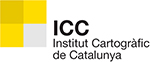
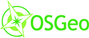

# 6as Jornadas de SIG Libre (2012)

Las Jornadas de SIG Libre de Girona celebran su 6ª edición los próximos 21, 22 y 23 de marzo 2012. Las Jornadas son una iniciativa del Servicio de SIG y Teledetección –SIGTE– de la Universitat de Girona que nacieron en 2007 y están dedicadas al programario libre en el campo de los SIG.

Edición tres edición, estas Jornadas demuestran la existencia de una comunidad SIG activa y dinámica, convirtiéndose en un punto de encuentro –cada marzo en Girona– donde compartir conocimientos, experiencias y fortalecer vínculos alrededor de las soluciones libres. Las Jornadas de SIG Libre son el evento de referencia en la comunidad SIG a nivel estatal que cuentan con más presencia internacional en cada nueva edición. Unas jornadas que apuestan más por el ‘mira cómo lo hago’ que por el ‘mira qué hago’. Las Jornadas de SIG Libre de Girona centran su interés en mostrar y dar a conocer las últimas novedades y tendencias emergentes en el campo de los SIG Libres, así como el uso de estas tecnologías geoespaciales libres. El eje del evento se basa en la presentación de nuevos desarrollos y librerías libres, mejoras en proyectos existentes, proyectos de integración y uso de soluciones libres,... tanto desde la Administración Pública como desde la empresa, así como divulgar los proyectos de investigación universitaria desarrollados con programario libre.

* 21, 22 y 23 de marzo de 2012
* Auditorio Palacio de Congresos de Girona.

Ponencias plenarias
====================

* **Implementación de Software Libre en la empresa: Oportunidad y riesgo** (Ignacio Guerrero, Andes Geoconsulting)
* **El nuevo impulso a la reutilización del RD 1495/2011** (Julián Valero, Universidad de Murcia)
* **Why gvSIG CE came about?** (José Antonio Canalejo, Víctor Olaya, Proyecto gvSIG CE)
* **El futuro de los SIG de Código Abierto: más allá de los estándares del OGC** (Gilberto Câmara, Director General del INPE)
* **Open Hardware** (David Cuartielles, Arduino)

Comunicaciones
=================

Dispositivos Móviles
---------------------------

* **Problemas en la implementación de algoritmos de routing de alta complejidad en dispositivos móviles: El caso Itiner@** L. Descamps Vila (ICA), J. Casas, J. Conesa, A. Pérez-Navarro (Universitat Oberta de Catalunya) **[Presentación](https://dugi-doc.udg.edu/handle/10256/4263)**
* **Itiner@: Ontología para la personalización de rutas turísticas en dispositivos móviles** L. Descamps Vila (ICA), J. Casas, J. Conesa, A. Pérez-Navarro (Universitat Oberta de Catalunya) **[Presentación](https://dugi-doc.udg.edu/handle/10256/4295)**
* **Rutas turísticas personalizadas en dispositivos móviles sin necesidad de conexión a internet: Itiner@** L. Descamps Vila (ICA), J. Casas, J. Conesa, A. Pérez-Navarro (Universitat Oberta de Catalunya) **[Presentación](https://dugi-doc.udg.edu/handle/10256/4314)**
* **Novedades de gvSIG Mini: acceso a datos vectoriales y servicios de POI's** A. Romeu, C. Sánchez (Prodevelop) **[Presentación](https://dugi-doc.udg.edu/handle/10256/4315)**

Visores y Webmapping
---------------------------

* **Implantación de Geoportales con soporte técnico profesionalizado en software libre** A. Romeu, A. del Rey, M. Montesinos (Prodevelop) **[Presentación](https://dugi-doc.udg.edu/handle/10256/4194)** | **[Vídeo](http://diobma.udg.edu/handle/10256.1/2447)**
* **Vissir3: Nuevas posibilidades de visualización e interacción con la cartografía del ICC.** A. Vidal (ICC) **[Presentación](https://dugi-doc.udg.edu/handle/10256/4195)** | **[Vídeo](http://diobma.udg.edu/handle/10256.1/2448)**
* **ICOS Carbon Data Portal** O. Fonts, M. García, F. González (geomati.co), J. Piera, J. Sorribas, J. Olivé (CSIC), A. Carrara (CEAM)  **[Presentación](https://dugi-doc.udg.edu/handle/10256/4196)** | **[Vídeo](http://diobma.udg.edu/handle/10256.1/2449)**
* **La EIEL y los Geoportales: Cómo poner la información a disposición de la ciudadanía** P. Sanxiao, A. Maneiro (iCarto) **[Presentación](https://dugi-doc.udg.edu/handle/10256/4197)** | **[Vídeo](http://diobma.udg.edu/handle/10256.1/2450)**
* **ikiMap, la plataforma social de la cartografía** M. García, F. González, V. González (geomati.co), A. Lamas, R. Cal, F. Sotelo (Sixtema) **[Presentación](https://dugi-doc.udg.edu/handle/10256/4198)** | **[Vídeo](http://diobma.udg.edu/handle/10256.1/2451)**
* **Geoservicios web SIOSE: un sistema de información como servicio público** X. Fernández, J. Delgado, N. Valcárcel, M.E. Caballero, M.A. Benito (IGN), A. Porcuna (Tragsatec) **[Presentación](https://dugi-doc.udg.edu/handle/10256/4199)** | **[Vídeo](http://diobma.udg.edu/handle/10256.1/2452)**
* **LEGENDiary: web 2.0 y app móvil** A. Busquets, T. Hernandez, R. Olivella, N. Pérez(SIGTE - Universitat de Girona)  **[Presentación](https://dugi-doc.udg.edu/handle/10256/4200)** | **[Vídeo](http://diobma.udg.edu/handle/10256.1/2453)**
* **Solución de alto rendimiento para el Geoportal de Turismo de la Comunidad Valenciana** J. Carrasco, J. Sanz (Prodevelop), S. Belentani (Agència Valenciana de Turisme **[Presentación](https://dugi-doc.udg.edu/handle/10256/4201)** | **[Vídeo](http://diobma.udg.edu/handle/10256.1/2454)**

Aplicaciones y Casos de Uso
---------------------------

* **Aplicación de los Sistemas de Información Geográfica en Astronomía** J. Gómez (ADIF), J. Mejuto, G. Rodríguez, M. Sánchez, J. Zamorano (Universidad Complutense de Madrid) **[Presentación](https://dugi-doc.udg.edu/handle/10256/4323)**
* **Participación ciudadana sobre el territorio: caso Proxecto Ríos** M. Borobio, A. Fernández, R. Alvite, J.I. Varela (Xunta de Galicia) **[Presentación](https://dugi-doc.udg.edu/handle/10256/4324)**
* **La aplicación de estadísticas y de los SIG en el estudio de las construcciones monumentales prehistóricas de la Amazonía brasileña** I. Rampanelli, A. Díez, V. Villaverde (Universitat de València), D. Pahl (UFPA)  **[Presentación](https://dugi-doc.udg.edu/handle/10256/4337)**
* **SIG libre y estándares abiertos en soluciones verticales de gestión de emergencias.** A. González (Emergya), D. Prades (Telefónica) **[Presentación](https://dugi-doc.udg.edu/handle/10256/4338)**
* **Aplicaciones de las TIG para el geomarketing.** P. Fernandez, J.P. Pérez (Geographica Studio) **[Presentación](https://dugi-doc.udg.edu/handle/10256/4982)**
* **Sistema de Información Geográfica del Ayuntamiento de Bétera basado en software libre** A. García (Ayuntamiento de Bétera) **[Presentación](https://dugi-doc.udg.edu/handle/10256/4983)**
* **Os SIG Open-Source aplicados à "Acessibilidade para Todos".** Pedro Costa (ProAsolutions)
* **El uso de Sistemas de Información Geográfica Libre en Costa Rica** Manuel Antonio Solano Mayorga (Escuela de Ciencias Geográficas, Universidad Nacional, Costa Rica) **[Presentación](https://dugi-doc.udg.edu/handle/10256/4233)**
* **Adaptación de OpenGeo Suite para la gestión integral de la Información Geográfica en el Ayuntamiento de Castellbisbal** M. Pericay (Geodata SL), O. Fonts (Geomati.co) **[Presentación](https://dugi-doc.udg.edu/handle/10256/5842)**
* **Construyendo un sistema de indexación y búsqueda de recursos georreferenciados** A. Beltrán, L. Díaz, J. Huerta (INIT - Universitat Jaume I) **[Presentación](https://dugi-doc.udg.edu/handle/10256/5856)**

Datos, Servicios Web y Análisis Comparativos
---------------------------

* **Callejero Digital de Andalucía Unificado** P. Gallardo (Grupo Avalon), J.A. Moreno (Junta de Andalucía) **[Presentación](https://dugi-doc.udg.edu/handle/10256/4204)** | **[Vídeo](http://diobma.udg.edu/handle/10256.1/2457)**
* **Cartociudad apuesta por el Software Libre** J. González, A. Velasco, A. González, J.M. Rubio, P. Verdejo, A.G. San Román, S. Mas (CNIG) **[Presentación](https://dugi-doc.udg.edu/handle/10256/4205)** | **[Vídeo](http://diobma.udg.edu/handle/10256.1/2458)**
* **Implementación de modelos de localización espacial siguiendo el estándar OGC WPS.** D. Oliveros (Indra Sistemas), J. Bosque (Universidad de Alcalá) **[Presentación](https://dugi-doc.udg.edu/handle/10256/4206)** | **[Vídeo](http://diobma.udg.edu/handle/10256.1/2459)**
* **Servicio de visualización acorde con perfil INSPIRE de ISO 19128-WMS 1.3.0, IGNBase**  C. Ruiz, L. Hernández, E. López, P. Abad, M. juanatey, V. Ramos, A. Sánchez, C. Soteres, A.F. Rodríguez (CNIG)  **[Presentación](https://dugi-doc.udg.edu/handle/10256/4207)** | **[Vídeo](http://diobma.udg.edu/handle/10256.1/2460)**
* **Comparativa entre OpenStreetMap y Cartociudad: caso de estudio de Valencia** N. Fernández, J.M. de Diego, A. Pérez-Navarro (Universitat Oberta de Catalunya)  **[Presentación](https://dugi-doc.udg.edu/handle/10256/4224)** | **[Vídeo](http://diobma.udg.edu/handle/10256.1/2461)**
* **El SIG Libre de las Jornadas de SIG Libre de Girona (2007-2011)** F.A. Varela, G. Crespo, F. Puga, J. López (CartoLAB)  **[Vídeo](http://diobma.udg.edu/handle/10256.1/2462)**

Aplicaciones Desktop y Bases de Datos
---------------------------
* **LocalGIS3** A. Pérez, S. Vicente (SETSI), M. Citores (COTESA) **[Presentación](https://dugi-doc.udg.edu/handle/10256/5857)**
* **GGL2: Una alternativa real para el geoprocesamiento** F. González, V. González (GearScape) **[Presentación](https://dugi-doc.udg.edu/handle/10256/5858)**
* **Base de datos PostGIS para la gestión de riesgos en la microrregión “Mélida Anaya Montes”** A. Ribó, F.O. Mira, J.M. Guerrero, L. Avilés, J. Barrio (Geólogos del Mundo - Delegación de Centroamérica), C.A. Magaña, J.A. Quintanilla (ACM Ingeniería Especializada - NODO GisConsulting), J. Molinas (Geólogos del Mundo - Delegación de Catalunya) **[Presentación](https://dugi-doc.udg.edu/handle/10256/5859)**
* **Evolución y mejora de un índice espacial sobre JASPA para H2** S. González, J.de Diego, A. Pérez Navarro (Universitat Oberta de Catalunya) **[Presentación](https://dugi-doc.udg.edu/handle/10256/5868)**
* **Integración de Sextante en ArcGIS y QGIS** V. Olaya (SEXTANTE) **[Presentación](https://dugi-doc.udg.edu/handle/10256/5869)**
* **CartoDB. Una base de datos geoespacial para el desarrollo fácil de aplicaciones web** J. de la Torre, S. Álvarez, J. Santana (Vizzuality)  **[Presentación](https://dugi-doc.udg.edu/handle/10256/5870)**

Aplicaciones 3D
---------------------------
* **Unlocking Geographical Information from Academia: an Open Source WebGIS Solution** B. Neves, A.M. Rodrigues, T. Santos, S. Freire (Universidade Nova de Lisboa)  **[Presentación](https://dugi-doc.udg.edu/handle/10256/4226)** | **[Vídeo](http://diobma.udg.edu/handle/10256.1/2463)**
* **gvSIG en España Virtual** V. Agazzi, N. Brodin, M. Montesinos (Prodevelop - Asociación gvSIG) **[Presentación](https://dugi-doc.udg.edu/handle/10256/4227)** | **[Vídeo](http://diobma.udg.edu/handle/10256.1/2464)**
* **Glob3 Mobile: hacia un SIG 3D para entornos Apple-iOS, Android y WebGL** M. De la Calle, D. Gómez (IGO Software), A. Trujillo, J.M. Santana, K. Perdomo, J.P. Suarez (Universidad de Las Palmas de Gran Canaria), A. Pedriza (COTESA) **[Presentación](https://dugi-doc.udg.edu/handle/10256/4228)** | **[Vídeo](http://diobma.udg.edu/handle/10256.1/2465)**
* **Servicio Web 3D (W3DS) en Geoserver** J. Rocha, N. Oliveira, P. Machado (Universidade do Minho), P. Mendes (PT Inovação), R. Alves (XLM) **[Presentación](https://dugi-doc.udg.edu/handle/10256/4229)** | **[Vídeo](http://diobma.udg.edu/handle/10256.1/2466)**
* **Geoserver y Realidad Aumentada. Extensión para la publicación de los repositorios cartográficos en los navegadores de Realidad Aumentada** A. Pedriza, M. Citores (COTESA) **[Presentación](https://dugi-doc.udg.edu/handle/10256/4230)** | **[Vídeo](http://diobma.udg.edu/handle/10256.1/2467)**
* **Visualización de archivos multidimensionales de predicciones meteorológicas HIRLAM en glob3** M. de la Calle, D. Gómez (IGO Software) **[Presentación](https://dugi-doc.udg.edu/handle/10256/4231)** | **[Vídeo](http://diobma.udg.edu/handle/10256.1/2468)**

Talleres
========

* **Taller 1: titol** (autor, empresa) **[Presentación]()** | **[Vídeo]()**

Patrocinadores
==============

