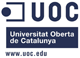
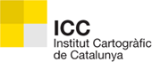
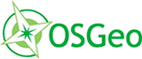

# 7as Jornadas de SIG libre (2013)

Las Jornadas de SIG Libre de Girona celebran su 7ª edición los próximos 6, 7 y 8 de marzo 2013. Una iniciativa del Servicio de SIG y Teledetección –SIGTE– de la Universitat de Girona que nació el año 2007 y que persigue la promoción y difusión del programario libre en el ámbito de los Sistemas de Información Geográfica.  

Edición tras edición, estas Jornadas demuestran la existencia de una comunidad SIG activa y dinámica, convirtiéndose en un punto de encuentro –cada marzo en Girona– donde compartir conocimientos, experiencias y fortalecer vínculos alrededor de las soluciones libres. Las Jornadas de SIG Libre son el evento de referencia en la comunidad SIG a nivel estatal que cuentan con más presencia internacional en cada nueva edición. El principal interés de estas jornadas está en la demostración y comunicación de las novedades más recientes y las últimas tendencias en el campo de los SIG Libres, así como en el uso de estas tecnologías geoespaciales libres. Más allá de los aspectos técnicos y de programa, el valor característico de las Jornadas es el ambiente familiar y de colaboración que se respira, facilitando el intercambio de conocimientos, experiencias y relaciones en un entorno encantador y acogedor como Girona.  

Las VII Jornadas de SIG Libre reunirán a más de un centenar de asistentes de la Administración Pública, Universidad y empresa, procedentes de todo el territorio español, europeo e internacional.

* 6, 7 y 8 de marzo de 2013
* Auditorio Palacio de Congresos de Girona

Ponencias plenarias
====================

* **Open Data como parte de un modelo sostenible de gestión de la información pública** (Alberto Ortiz de Zárate, Atención Ciudadana del Departamento de Justicia y Administración Pública del Gobierno Vasco). **[Vídeo](http://diobma.udg.edu/handle/10256.1/2944)**
* **Free as the wind: The QGIS approach to community development** (Paolo Cavallini, Faunalia) **[Presentación](https://dugi-doc.udg.edu/handle/10256/7667)** | **[Vídeo](http://diobma.udg.edu/handle/10256.1/2945)**
* **Clouds on the horizon? Aspectos legales del Cloud Computing en un contexto FOSS** (Malcolm Bain, ID Law Partners) **[Presentación](https://dugi-doc.udg.edu/handle/10256/7641)** | **[Vídeo](http://diobma.udg.edu/handle/10256.1/2947)**
* **Clouds on the horizon? Mejores prácticas para el despliegue de aplicaciones en nube** (Sergio Morales - ExpertosenTI) **[Presentación](https://dugi-doc.udg.edu/handle/10256/7640)** | **[Vídeo](http://diobma.udg.edu/handle/10256.1/2946)**
* **El GIS ha muerto. Larga vida al GIS** (Javier de la Torre, Vizzuality) **[Presentación](https://dugi-doc.udg.edu/handle/10256/7665)** | **[Vídeo](http://diobma.udg.edu/handle/10256.1/2948)**

Comunicaciones
=================

Sesión Datos y IDEs
---------------------------

* **Uso de fuentes de información geográfica voluntarias en proyectos de ingeniería** C.E. Borges, A Pijoan, G. Sorrosal, I. Oribe-García, M. González, O. Kamara Esteban (Deusto Tech, Deusto Institute of Technology) **[Presentación](https://dugi-doc.udg.edu/handle/10256/7655)**
* **Representación de ficheros SensorML & O&M en clientes Android atacando una base de datos XML para datos oceanográficos** J. Olivé, J. Sorribas (Unidad de Tecnología Marina - CSIC), J. Piera (CMIMA - CSIC) **[Presentación](https://dugi-doc.udg.edu/handle/10256/7668)**
* **Desarrollo de una herramienta de visualización de datos oceanográficos: Modelos y Observaciones** J. Fernández, J. López, I. Carlos Lorenzo, F. Hermosilla (Soluciones de Ingeniería Marítima Operacional - SIMO), F. Jerez, M. Espino (Laboratori d’Enginyería Marítima - Universitat Politècnica de Catalunya) **[Presentación](https://dugi-doc.udg.edu/handle/10256/7669)**
* **IDEARQ: Una infraestructura de datos espaciales para la publicación de datos arqueológicos** C. Fernández, I. del Bosque, R. Gutiérrez, E. Pérez (Unidad de SIG - CSIC), A. Uriarte, A. Fraguas, J.M. Vicent (Instituto de Historia - CSIC) **[Presentación](https://dugi-doc.udg.edu/handle/10256/7656)**
* **Terra Communis (tComm): A free data provider for historical census micro-data** A.M. Rodrigues, B. Neves, C. Rebelo (e-GEO Research Centre for Geography and Regional Planning - Universidade Nova de Lisboa) **[Presentación](https://dugi-doc.udg.edu/handle/10256/7657)**
* **Geonetwork & GeoCat Bridge: Acceso a datos geoespaciales en una infraestructura de datos INSPIRE** M. Arias, J. García (GeoCat bv)
* **Jauría de metadatos** I. Sánchez (OpenStreetMap Foundation) **[Presentación](https://dugi-doc.udg.edu/handle/10256/7670)**
* **Integración de datos geoespaciales libres para la simulación y gestión de incendios forestales** J. Figueras, A. Guasch, J. Casanovas (inLab FIB - Universitat Politècnica de Catalunya)

Sesión Casos de Uso
----------------------------

* **Aplicación de un Sistema de Información Geográfica Libre** M.A. Solano (Universidad Nacional de Costa Rica)
* **Desarrollo de aplicación para dispositivo móvil con software libre para el uso en zonas de alud** M. Pérez, N. Querol, J. Marturià (Institut Geològic de Catalunya - IGC)  **[Presentación](https://dugi-doc.udg.edu/handle/10256/7642)** | **[Vídeo](http://diobma.udg.edu/handle/10256.1/2951)**
* **Un modelo de la distribución geográfica de la frecuentación de visitantes en espacios naturales** A. Lobo (Institut Ciències de la Terra “Jaume Almera” - CSIC), C. Arjona (Institut de Ciència i Tecnologia Ambiental - Universitat Autònoma de Barcelona)  **[Presentación](https://dugi-doc.udg.edu/handle/10256/7643)** | **[Vídeo](http://diobma.udg.edu/handle/10256.1/2952)**
* **Modelling sea-level rise in the Lisbon city coastal area, using Free and Open Source Technologies** B. Neves, C. Rebelo, A.M. Rodrigues (e-GEO Research Centre for Geography and Regional Planning - Universidade nova de Lisboa)  **[Presentación](https://dugi-doc.udg.edu/handle/10256/7644)** | **[Vídeo](http://diobma.udg.edu/handle/10256.1/2953)**
* **Estudio del número de masas de transición presentes en la desembocadura del río Miño (Galicia)** A. Freire, S. Pérez (Laboratorio de Ecoloxía Mariña - Universidade de Vigo), R. Beiras (Estación de Ciencias Mariñas de Toralla - Universidade de Vigo)  **[Presentación](https://dugi-doc.udg.edu/handle/10256/7645)** | **[Vídeo]()**
* **Estudio del número de masas de transición presentes en la desembocadura del río Miño (Galicia)** A. Freire, S. Pérez (Laboratorio de Ecoloxía Mariña - Universidade de Vigo), R. Beiras (Estación de Ciencias Mariñas de Toralla - Universidade de Vigo)  **[Presentación](https://dugi-doc.udg.edu/handle/10256/7645)** | **[Vídeo](http://diobma.udg.edu/handle/10256.1/2954)**
* **Lineamientos para el desarrollo de aplicaciones SIG Web** A. Yanza, B. Acosta (Centro de Información Geográfica - Universidad EAFIT)  **[Presentación](https://dugi-doc.udg.edu/handle/10256/7658)**
* **Plataforma libre de indicadores territoriales del proyecto DESOURB** A. Lamas, F. Sotelo, R. Cal, X. Portas (SIXTEMA SL), M. Borobio, J.I. Varela (IET - Xunta de Galicia)  **[Presentación](https://dugi-doc.udg.edu/handle/10256/7646)** | **[Vídeo](http://diobma.udg.edu/handle/10256.1/2956)**
* **Extraction of urban parameters from 3D point cloud within GRASS** C. Rebelo, A.M. Rodrigues, B. Neves, J.A. Tenedório (eGEO Research Centre for Geography and Regional Planning - Universidade Nova de Lisboa), J.A. Gonçalves (Faculdade de Ciências - Universidade do Porto)  **[Presentación](https://dugi-doc.udg.edu/handle/10256/7647)** | **[Vídeo](http://diobma.udg.edu/handle/10256.1/2957)**

Sesión 1
---------------------------

* **Cosas que hacer en compañía de OSM** T. Hernández, A. Busquets, L. Olivas, J. Sitjar (SIGTE - Universitat de Girona) **[Presentación](https://dugi-doc.udg.edu/handle/10256/7659)**
* **Implantación de un servidor SOS para la publicación de datos de sensores medioambientales en la IDE OTALEX-C** I. Brodin, C. Pérez, J.G. Sanz (Prodevelop SL), P. Vivas (CNIG - IGN) **[Presentación](https://dugi-doc.udg.edu/handle/10256/7660)**
* **Visor HLanData, exprimiendo WFS** J.L. Cardoso, I. Pérez, M. Santana, R. Urío (Tracasa) **[Presentación](https://dugi-doc.udg.edu/handle/10256/7661)**
* **Editor Web Arqueológico mediante WFS-T** J.L. Cardoso, M. Villafranca, M. Santana (Tracasa) **[Presentación](https://dugi-doc.udg.edu/handle/10256/7662)**
* **SIGTE Maps Cloud: Nuevo servicio de mapas en la nube** A. Busquets, R. Olivella (SIGTE - Universitat de Girona) **[Presentación](https://dugi-doc.udg.edu/handle/10256/7663)**
* **GeoServer, más allá de un servidor WMS** O. Fonts, F. González, M. García (Geomati.co) **[Presentación](https://dugi-doc.udg.edu/handle/10256/7664)**

Sesión 2
--------------------------

* **Geotransacciones** I. Arnaiz (Arnaiz Consultores SL) **[Presentación](https://dugi-doc.udg.edu/handle/10256/7648)** | **[Vídeo](http://diobma.udg.edu/handle/10256.1/2960)**
* **Curso online de SIG Libre en Cooperación al Desarrollo desde una visión multidisciplinar** S. Fernández (Enxenería Sen Fronteiras - Universidad de Coruña), J. Arévalo, D. Pascual (Associació Catalana d’Enginyeria Sense Fronteres), Fco.A. Varela, F. Puga (CartoLAB - Universidad de Coruña), G. Martínez (iCarto), R. Crecente, M. Cordero (LaboraTE - Universidade de Santiago de Compostela) **[Vídeo](http://diobma.udg.edu/handle/10256.1/2961)**
* **GeoStore: Nuevas técnicas de distribución y comercialización web de contenidos digitales geoposicionados** V. Sanjaime (prodevelop SL), R. Olivella, G. Boix (SIGTE - Universitat de Girona), G. Beltrán (Geoturismo) **[Presentación](https://dugi-doc.udg.edu/handle/10256/7649)** | **[Vídeo](http://diobma.udg.edu/handle/10256.1/2962)**
* **Avances en la integración de GGL2 con gvSIG y QGIS** V. González (Freelance), F. González (Freelance - Geomati.co) **[Presentación](https://dugi-doc.udg.edu/handle/10256/7650)** | **[Vídeo](http://diobma.udg.edu/handle/10256.1/2963)**
* **Creación de un módulo espacial OLAP para Saiku** A. Lamas, F. Sotelo (SIXTEMA), M. Borobio, J.I. Varela (IET - Xunta de Galicia) **[Presentación](https://dugi-doc.udg.edu/handle/10256/7672)** | **[Vídeo](http://diobma.udg.edu/handle/10256.1/2964)**
* **SIG Libre y datos abiertos como base tecnológica en iniciativas de cambio social** J. Sánchez (Freelance)  **[Vídeo](http://diobma.udg.edu/handle/10256.1/2965)**

Sesión 3
-------------------------

* **Integración de un sistema de posicionamiento indoor en aplicaiones SIG para dispositivo móvil** L. Descamps (Informática y Comunicaciones Avanzadas - ICA), A. Pérez-Navarro, J. Conesa (Estudis d’Informàtica, Multimèdia i Telecomuniació - Universitat Oberta de Catalunya) **[Presentación](https://dugi-doc.udg.edu/handle/10256/7651)** | **[Vídeo](http://diobma.udg.edu/handle/10256.1/2966)**
* **Indoor Spaces in OpenStreetMap** N.I. Alves, J.G. Rocha (Departamento de Informática - Universidade do Minho) **[Presentación](https://dugi-doc.udg.edu/handle/10256/7652)** | **[Vídeo](http://diobma.udg.edu/handle/10256.1/2967)**
* **IDENA Mobile, explorando HTML5** J.L. Cardoso, F. Lacunza, C. Sabando (Tracasa) **[Presentación](https://dugi-doc.udg.edu/handle/10256/7653)** | **[Vídeo](http://diobma.udg.edu/handle/10256.1/2968)**
* **Integración de GeoTools en gvSIG CEV** González (Freelance), F. González (Freelance - Geomati.co) **[Presentación](https://dugi-doc.udg.edu/handle/10256/7654)** | **[Vídeo](http://diobma.udg.edu/handle/10256.1/2969)**
* **SmallData vs BigData: Peligros de usar BigData en el ámbito SIG** V. Olaya (OpenGeo) **[Presentación](https://dugi-doc.udg.edu/handle/10256/7666)** | **[Vídeo](http://diobma.udg.edu/handle/10256.1/2970)**

Otros
---------------------

* **Tutorial práctico: GeoCat Bridge**
* **I GeoInquietos Nacional: «Piensa globalmente, actúa localmente»**

Sesión Clausura
---------------------

* **Desarrollo en abierto de Software Libre: una panorámica a vuelo de pájaro** Jesus M. González Barahona - Universidad Rey Juan Carlos **[Presentación](https://dugi-doc.udg.edu/handle/10256/7674)** | **[Vídeo](http://diobma.udg.edu/handle/10256.1/2971)**

Talleres
========

* **Taller 1: Introducción a OpenGeo Suite** (Victor Olaya, OpenGeo).
* **Taller 2: Mapsforge: Mapas vectoriales de OpenStreetMap off-line en Android** (Santiago Higuera, mercatorlab SL).
* **Taller 3: Taller de Introducción a CartoDB** (Javier de la Torre, Vizzuality).
* **Taller 4: Geocomputación con Python** (Daniel Arribas-Bel, -Department of Spatial Economics, VU University, Amsterdam-).

Patrocinadores
==============

