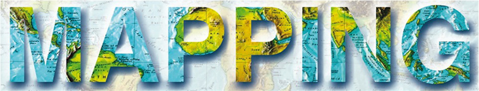

# 8as Jornadas de SIG Libre (2014)

Contenido de las Jornadas de SIG Libre 2014

Sesión inaugural
==================

* **nom** (carrec, posició)

Ponencias plenarias
====================

* **El impacto de los datos geográficos en la sociedad abierta** Alberto Abella - Socio Director de Operaciones en Rooter **[Presentación](https://dugi-doc.udg.edu/handle/10256/9031)** | **[Vídeo](http://diobma.udg.edu/handle/10256.1/3354)**
* **Open Data Tools For Social Good** Chris R. Albon - Director of Data Projects en Ushahidi **[Presentación](https://dugi-doc.udg.edu/handle/10256/9032)** | **[Vídeo](http://diobma.udg.edu/handle/10256.1/3355)**
* **GNSS-SDR, un receptor definido por software abierto** Carles Fernández-Prades - Head of the Communication System Division, Centre Tecnològic de Telecomunicacions de Catalunya **[Presentación](https://dugi-doc.udg.edu/handle/10256/9033)** | **[Vídeo](http://diobma.udg.edu/handle/10256.1/3356)** 
* **Future trends in GI - the UN perspective** John Abbott - Head of Access and Service at Ordnance Survey **[Vídeo](http://diobma.udg.edu/handle/10256.1/3357)**
* **Cartografiando la Galaxia: El procesado de datos de la misión Gaia** Jordi Portell - Institut d’Estudis Espacials de Catalunya (IEEC) **[Presentación](https://dugi-doc.udg.edu/handle/10256/9034)** | **[Vídeo](http://diobma.udg.edu/handle/10256.1/3358)**

Comunicaciones
=================

Comparativas / Benchmarks
---------------------------

* **Procesado de datos LiDAR en QGIS con SPDlib** R. Antonlín, J.Suárez (Centre for Forest Resources and Management - NRS),
P. Bunting (Aberystwyth University) **[Presentación](https://dugi-doc.udg.edu/handle/10256/9073)** 
* **OpenLayers y Leaflet: Code-Combat** M. Arias (GeoCat), M. Arcos (Emergya) **[Presentación](https://dugi-doc.udg.edu/handle/10256/9072)** 
* **Estudio comparativo de software SIG y SGBD en entornos Open Source y Propietario aplicados a la Base Topográfica Nacional 1:100.000 (BTN100)** J.A. Merino, R. Sierra, J.J. Alonso, F. Sánchez (IGN) **[Presentación](https://dugi-doc.udg.edu/handle/10256/9074)** 
* **Editores de Metadatos** M. Arias (GeoCat) **[Presentación](https://dugi-doc.udg.edu/handle/10256/9071)** 

Universidad / Investigación
---------------------------

* **Herramientas TIG para el análisis del comportamiento de turistas en la ciudad de Girona** T. Hernández, R. Olivella, J. Sitjar, Ll. Vicens (SIGTE - UdG) **[Presentación](https://dugi-doc.udg.edu/handle/10256/9035)** | **[Vídeo](http://diobma.udg.edu/handle/10256.1/3359)*
* **Building 3D City models: Testing and Comparing Laser scanning and low-cost UAV data using FOSS technologies** C. Rebelo, A. Rodrigues, J. Tenedório (e-GEO Research Centre for Geography and Regional Planning - UNL), J. Gonçalves (Universidade do Porto), J. Marnoto (SINFIC S.A.) **[Presentación](https://dugi-doc.udg.edu/handle/10256/9036)** | **[Vídeo](http://diobma.udg.edu/handle/10256.1/3360)*
* **GEONEFROSALVA, una plataforma SIG en software libre, para la caracterización de los Factores de Riesgo de la Enfermedad Renal Crónica de causas no tradicionales que afecta a la población agrícola de El Salvador** A.Ribó, E. Vela, E. Quinteros, R. Mejía, C. Orantes (Instituto Nacional de Salud- Ministerio de Salud, El Salvador), J. Molinas (UdG), D.L. López (Ohio University) **[Presentación](https://dugi-doc.udg.edu/handle/10256/9037)** | **[Vídeo](http://diobma.udg.edu/handle/10256.1/3361)*
* **GIS & Modelado Procedural** G. Besuievsky, G. Patow (Grup de Geometria i Gràfics - UdG) **[Presentación](https://dugi-doc.udg.edu/handle/10256/9038)** | **[Vídeo](http://diobma.udg.edu/handle/10256.1/3362)*
* **STIMULO: Sistema de Transporte Logístico Inteligente Multimodal** J. Sanz (Prodevelop SL) **[Presentación](https://dugi-doc.udg.edu/handle/10256/9039)** | **[Vídeo](http://diobma.udg.edu/handle/10256.1/3363)*
* **Nuevo algoritmo de coste acumulado condicionado para modelos de accesibilidad implementado con sextante sobre gvSIG** F.A. Varela (CartoLAB - UdC) **[Presentación](https://dugi-doc.udg.edu/handle/10256/9040)** | **[Vídeo](http://diobma.udg.edu/handle/10256.1/3364)*
* **Uso de algoritmos de enrutamiento para el cálculo de indicadores de sostenibilidad** A. Pijoan, C.E. Borges, Y.K. Penya, A. Alonso-Vicario (Deusto Tech) **[Presentación](https://dugi-doc.udg.edu/handle/10256/9041)** | **[Vídeo](http://diobma.udg.edu/handle/10256.1/3365)*

Presentaciones Técnicas Avanzadas
---------------------------

* **XVM - Unas vitaminas sobre OpenLayers** M. García (geomati.co), J.I. Varela (Freelance) **[Presentación](https://dugi-doc.udg.edu/handle/10256/9060)** 
* **Geofier, API Rest geográfica para bases de datos no espaciales** J.I Varela (Freelance) **[Presentación](https://dugi-doc.udg.edu/handle/10256/9075)**
* **csUrbanismo, SIG para la redacción y cálculo de planeamientos lineales** D. Trillo, J.I. Lamas, A. Mayán (Avansig S.L.L.) **[Presentación](https://dugi-doc.udg.edu/handle/10256/9076)** 

Casos de Uso
---------------------------

* **La georreferenciación de la población de Catalunya** L.E. Suñé (Idescat) **[Presentación](https://dugi-doc.udg.edu/handle/10256/9070)** 
* **Georreferenciación de documentación ferroviaria mediante indexación semántica y su publicación, usando software libre** J. Gómez (Adif) **[Presentación](https://dugi-doc.udg.edu/handle/10256/9069)** 
* **Producción de la Base Topográfica Nacional 1:100.000 (BTN100) mediante base de datos espacial PostGIS** R. Sierra, J.A. Merino, T. Gullón (IGN) **[Presentación](https://dugi-doc.udg.edu/handle/10256/9068)** 
* **El software libre y el mundo real. Despliegue de software en países en vías de desarrollo** F. González (geomati.co) **[Presentación](https://dugi-doc.udg.edu/handle/10256/9067)** 
* **Experiencia de colaboración en el desarrollo de GIS Open Source (QGIS, GDAL/OGR y GeoServer-GWC)** A. Huarte (Tracasa) **[Presentación](https://dugi-doc.udg.edu/handle/10256/9066)**
* **Implementación de QGIS en el Ayuntamiento de Sant Sadurní d’Anoia** C. López (PSIG) **[Presentación](https://dugi-doc.udg.edu/handle/10256/9065)** 

Presentaciones Técnicas Introductorias
---------------------------

* **PostgreSQL y PostGIS 2.0 aplicados al mundo de la ingeniería hidráulica y fluvial** X. Torret (tècnicsassociats), V. Mediana (UPC-GITS) **[Presentación](https://dugi-doc.udg.edu/handle/10256/9046)** | **[Vídeo](http://diobma.udg.edu/handle/10256.1/3368)*
* **Procesos web geoespaciales: dificultades y alternativas en el caso del visor SACOSTA** G. Frontera, P. Balaguer (ICTS SOCIB), D. March (IMEDEA - CSIC) **[Presentación](https://dugi-doc.udg.edu/handle/10256/9047)** | **[Vídeo](http://diobma.udg.edu/handle/10256.1/3369)*
* **gvSIG CE: Últimos avances** F. González, V. González (geomati.co) **[Presentación](https://dugi-doc.udg.edu/handle/10256/9057)** | **[Vídeo](http://diobma.udg.edu/handle/10256.1/3370)*
* **GeoCat Live: una plataforma Cloud basada en servidores SIG Open source** J.B. García (GeoCat) **[Presentación](https://dugi-doc.udg.edu/handle/10256/9048)** | **[Vídeo](http://diobma.udg.edu/handle/10256.1/3371)*
* **GeoNetwork 3** J.B. García (GeoCat) **[Presentación](https://dugi-doc.udg.edu/handle/10256/9049)** | **[Vídeo](http://diobma.udg.edu/handle/10256.1/3372)*
* **MapStore, crear, salvar y compartir mashups de manera simple e intuitiva** A. Díaz (GeoSolutions) **[Presentación](https://dugi-doc.udg.edu/handle/10256/9050)** | **[Vídeo](http://diobma.udg.edu/handle/10256.1/3373)*

Dispositivos móviles
---------------------------

* **Glob3 Mobile. Novedades en 2013** M. de la Calle, D. Gómez-Deck (Igo Software - Glob3 Mobile), A. Trujillo, J.M. Santana (ULPGC) **[Presentación](https://dugi-doc.udg.edu/handle/10256/9064)** 
* **SIG Libre para la Gestión de Rutas Escolares** M. Arcos, A. González (Emergya) 
* **Aplicación móvil del SIG de Parques y Jardines de Figueres** A. Busquets, R. Olivella (SIGTE - UdG) **[Presentación](https://dugi-doc.udg.edu/handle/10256/9063)** 
* **Desarrollo de una arquitectura SaaS para la publicación automática de aplicaciones de mapas en dispositivos móviles**
M. de la Calle, D. Gómez-Deck (Igo Software - Glob3 Mobile) **[Presentación](https://dugi-doc.udg.edu/handle/10256/9061)** 
* **vintiOS- viticultura de precisión** A. Otegi, D. Ruiz (Strategic Graphic Systems SL) **[Presentación](https://dugi-doc.udg.edu/handle/10256/9062)** 

IDE / OWS / INSPIRE
---------------------------

* **Sensor Widgets: Visualización ligera de datos de sensores** O. Fonts (geomati.co) **[Presentación](https://dugi-doc.udg.edu/handle/10256/9051)** | **[Vídeo](http://diobma.udg.edu/handle/10256.1/3374)*
* **Nuevo entorno de explotación y visualización de datos geoespaciales basado en la plataforma Wirecloud** J. Sánchez (GeoNaTec), J. Soriano, A. Vera, B. Illescas (UPM), A.F Rodríguez (IGN) **[Presentación](https://dugi-doc.udg.edu/handle/10256/9052)** | **[Vídeo](http://diobma.udg.edu/handle/10256.1/3375)*
* **Puerto de Barcelona: Modelo espacio-temporal con Open Source y servicios OGC** E. Rodellas, J. Torres, L. Damea (Autoridad Portuaria de Barcelona) **[Presentación](https://dugi-doc.udg.edu/handle/10256/9053)** | **[Vídeo](http://diobma.udg.edu/handle/10256.1/3376)*
* **Experiencia de publicación de un servicio teselado de mapas WMTS RESTful para IDENA** A. Huarte, F. Lacunza, J.L. Cardoso, C. Sánchez (Tracasa) **[Presentación](https://dugi-doc.udg.edu/handle/10256/9054)** | **[Vídeo](http://diobma.udg.edu/handle/10256.1/3377)*
* **Portal de Coordinación de Canalizaciones Subterráneas** J.L. Cardoso, I. Pérez, R.Urio (Tracasa) **[Presentación](https://dugi-doc.udg.edu/handle/10256/9056)** | **[Vídeo](http://diobma.udg.edu/handle/10256.1/3378)*

Tutoriales Técnicos
---------------------------

* **Presentación del proyecto «GeoTalleres»: Proyecto Abierto y Colaborativo para la creación de materiales docentes** F. González (geomati.co) 
* **Presentación del producto “GeoCat Live + Bridge”** M. Arias (GeoCat)

Otros
---------------------------

* **OpenApps4GEO. Presentación y entrega de premios** **[Vídeo](http://diobma.udg.edu/handle/10256.1/3366)** 
* **Mesa de debate sobre “Datos Abiertos” organizada por el Col·legi de Geògrafs**  **[Vídeo](http://diobma.udg.edu/handle/10256.1/3367)**

Sesión Clausura
---------------------------

* **Panorama actual del FOSS4G** OSGeo-ES  **[Presentación](https://dugi-doc.udg.edu/handle/10256/9055)** | **[Vídeo](http://diobma.udg.edu/handle/10256.1/3379)**

Patrocinadores
==============

