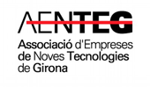
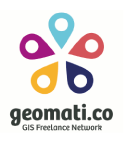
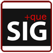
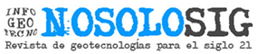

# 9as Jornadas de SIG libre (2015)

Las Jornadas de SIG Libre son una iniciativa del SIGTE de la Universitat de Girona y se han convertido en el evento en tecnologías geoespaciales libres de referencia a nivel estatal, reuniendo a más de 150 profesionales vinculados al mundo de la tecnología y de la información geográfica.  

* 25,26 y 27 de marzo 2015
* Auditori Palau de Congressos de Girona

Ponencias plenarias
====================

* **Open core, dual licensing, master subscription, commercial open source, product specialists- mucha jerga para hablar de cómo hacer dinero con el Open Source: Hablemos de sus aspectos legales** Malcolm Bain - IdLawPartners **[Presentación](https://dugi-doc.udg.edu/handle/10256/10220)** | **[Vídeo](http://diobma.udg.edu/handle/10256.1/3748)**
* **Periodismo de datos, y la visualización de datos abiertos** Alberto Labarga - NavarraBioMed **[Presentación](https://dugi-doc.udg.edu/handle/10256/10221)** | **[Vídeo](http://diobma.udg.edu/handle/10256.1/3749)**
* **El potencial de las redes sociales en el análisis y la visualización geoespacia** Óscar Marín - Outliers Collective **[Presentación](https://dugi-doc.udg.edu/handle/10256/10223)** | **[Vídeo](http://diobma.udg.edu/handle/10256.1/3751)**
* **Algunas ideas sobre música, literatura y mapas** Víctor Olaya - Boundlessgeo **[Presentación](https://dugi-doc.udg.edu/handle/10256/10224)** | **[Vídeo](http://diobma.udg.edu/handle/10256.1/3752)**

Comunicaciones
=================

IDE/INSPIRE/OGC/OWS
---------------------------

* **Euskalgeo, una IDE transfronteriza.** M. Ayestaran (Gaindegia) **[Presentación](https://dugi-doc.udg.edu/handle/10256/10239)**
* **Hacia un registro estadístico del territorio.** E. Suñé (IDESCAT) **[Presentación](https://dugi-doc.udg.edu/handle/10256/10240)**
* **API SITNA, API Javascript para visualización de datos georreferenciados en aplicaciones web.** F. Lacunza (TRACASA) **[Presentación](https://dugi-doc.udg.edu/handle/10256/10241)**
* **Transformación y explotación de datos hidrográficos con herramientas ETL.** R. Sierra, C. Sevilla, E. Nuñez, J. Delgado, G. Martín- Asín (IGN) **[Presentación](https://dugi-doc.udg.edu/handle/10256/10242)**
* **OWS y GeoPackage, estándares en el móvil.** M. Arias (Geocat) **[Presentación](https://dugi-doc.udg.edu/handle/10256/10243)**
* **Citizen science y Smart Cities, las futuras IDE.** M. Arias (Geocat) **[Presentación](https://dugi-doc.udg.edu/handle/10256/10244)**

Presentación Técnica Avanzada
---------------------------

* **Georreferenciación de vídeos: sincronización de vídeo y GPS** S. Higuera (MercatorLab) **[Presentación](https://dugi-doc.udg.edu/handle/10256/10225)** | **[Vídeo](http://diobma.udg.edu/handle/10256.1/3753)**
* **Global Atlas Mobile Application for IRENA Organization** I. Brodin, D. Gastón, V. Sanjaime, A. del Rey (Prodevelop) **[Presentación](https://dugi-doc.udg.edu/handle/10256/10226)** | **[Vídeo](http://diobma.udg.edu/handle/10256.1/3754)**
* **TMB DataHub – NoSQL Spatial Storage Stack** S. Edo, E. Porquet (TMB) **[Presentación](https://dugi-doc.udg.edu/handle/10256/10227)** | **[Vídeo](http://diobma.udg.edu/handle/10256.1/3755)**
* **Geosisma un plugin de QGIS: Cómo enlazar C++, Python y Javascript para el reuso de plantillas web** L. Pirelli (Freelance) **[Presentación](https://dugi-doc.udg.edu/handle/10256/10228)** | **[Vídeo](http://diobma.udg.edu/handle/10256.1/3756)**
* **Servidor de mapas de alta disponibilidad con Jboss, GeoServer y PostGIS** D.Tabernero, C.Moya (INCLAM) **[Presentación](https://dugi-doc.udg.edu/handle/10256/10229)** | **[Vídeo](http://diobma.udg.edu/handle/10256.1/3757)**
* **Big Data y Bases de Datos Espaciales: una análisis comparativo** J. Simoes, R. Giménez, M. Planagumà (BDigital) **[Presentación](https://dugi-doc.udg.edu/handle/10256/10230)** | **[Vídeo](http://diobma.udg.edu/handle/10256.1/3758)**

Actividades Académicas y de Investigación
---------------------------

* **GPXParser: Extensión del formato de datos GPX que permite incorporar a los puntos información procedente de sensores** S. Higuera (MercatorLab) **[Presentación](https://dugi-doc.udg.edu/handle/10256/10245)**
* **Crowd sourced vs centralized data for transport planning: a case study of bicycle path data in the UK** R. Lovelace (University of Leeds) **[Presentación](https://dugi-doc.udg.edu/handle/10256/10246)**
* **SmartPort, sistema para la visualización y gestión de información del Puerto de la Luz de las Palmas de G. C.** J.P. Suarez, A. Trujillo, C. Domínguez, P. Fernandez, J. Santana, A. Sánchez, S. Ortega, J.M. Santana (Universidad de Las Palmas de Gran Canaria) **[Presentación](https://dugi-doc.udg.edu/handle/10256/10247)**
* **Recreación virtual 3D de vuelos de Drones con Cesium.js y Oculus Rift** M. Di Paolantonio, C. González, M.J. Latorre, F. Pedrera (Deimos-Space) **[Presentación](https://dugi-doc.udg.edu/handle/10256/10248)**
* **Reconstrucción de la geometría del perfil longitudinal de una carretera a partir de sus pendientes** S. Higuera (MercatorLab) **[Presentación](https://dugi-doc.udg.edu/handle/10256/10249)**
* **Georreferenciación colaborativa de imágenes nocturnas tomadas desde la ISS para estudios de consumo energético y contaminación lumínica** A. Sánchez, J. Gómez, J. Zamorano, R. Navas, D. Lombraña (Universidad Complutense de Madrid) **[Presentación](https://dugi-doc.udg.edu/handle/10256/10250)**

Caso de uso/éxito
---------------------------

* **Enfoque sostenible al despliegue de geoportales en Latinoamerica** F. González (geomati.co)
* **Geosimulaciones: cuando un SIG no es suficiente** A. Pijoan, O. Kamara, C.E. Borges, I. Oribe-García, C. Martín-Andonegui, A. Alonso- Vicario (Universidad de Deusto) **[Presentación](https://dugi-doc.udg.edu/handle/10256/10234)** | **[Vídeo](http://diobma.udg.edu/handle/10256.1/3760)**
* **Crowd-data, open-data, linked-data y cómo seguir usando INSPIRE** M. Arias (Geocat) **[Presentación](https://dugi-doc.udg.edu/handle/10256/10235)** | **[Vídeo](http://diobma.udg.edu/handle/10256.1/3761)**
* **Visualización de series temporales oceanográficas mediante SOS.js** S. Soto, O. Chic, J. Guillen (CSIC) **[Presentación](https://dugi-doc.udg.edu/handle/10256/10236)** | **[Vídeo](http://diobma.udg.edu/handle/10256.1/3762)**
* **Evolución del GIS en Transports Metropolitans de Barcelona** S. Edo, E. Porquet (TMB) **[Presentación](https://dugi-doc.udg.edu/handle/10256/10237)** | **[Vídeo](http://diobma.udg.edu/handle/10256.1/3763)**
* **Mapas de cobertura móvil para la web con CartoDB y SW Libre** C. González, J. Arévalo, E. Carceller, F. Pedrera, J. Blanco (Deimos-Space) **[Presentación](https://dugi-doc.udg.edu/handle/10256/10238)** | **[Vídeo](http://diobma.udg.edu/handle/10256.1/3764)**

Otros
--------------------------

* **GeoSmartCity: Open geo-data for innovative services and user applications towards Smart Cities** Ll. Vicens, J. Sitjar, G. Boix (SIGTE-Universitat de Girona) **[Presentación](https://dugi-doc.udg.edu/handle/10256/10368)**
* **Uso de SL para el estudio del esfuerzo pesquero en la costa de Catalunya** J.A. García, G. Gorelli, M. Carretón, L. Martínez Posse, J. Baptista (CSIC) **[Presentación](https://dugi-doc.udg.edu/handle/10256/10369)**
* **La Infraestructura de Datos Espaciales de la Diputación de Badajoz: Dónde la convivencia es posible** M. Rojas, U. Gamero (Diputación de Badajoz)
* **Gestor de expedientes de obra en QGIS en el Ayuntamiento de Cubelles** C. López (PSIG)
* **Geoconsenso: acuerdos multidisciplinarios en el territorio como soporte a la toma de decisiones** J.D. Castillo, A. Jiménez, M.A. Núñez, J.M. Monguet (Universitat Politècnica de Catalunya) **[Presentación](https://dugi-doc.udg.edu/handle/10256/10370)**
Ponencia clausura
---------------------------

* **Where is the Cathedral and the Bazaar: some musings on openness, ecosystems and bringing geo to the web** Ed Parsons - Google   **[Vídeo](http://diobma.udg.edu/handle/10256.1/3765)**

Talleres
========

* **Taller 1: Introducción al desarrollo de Plugin para QGIS** Luigi Pirelli.
* **Taller 2: Mapas web interactivos con D3.js** Roger Veciana.
* **Taller 3: Análisis de datos geo-posicionados de Redes Sociales con QGIS** Joana Simoes.
* **Taller 4: Teledetección con GRASS GIS** Josep Sitjar y Alexandre Busquets (SIGTE).
* **Taller 5: Geovoluntariado con HOT: ayudando al mundo a través de la cartografía** Pedro Juan Ferrer y Jorge Sanz.
* **Taller 6: R: A GIS Command line** Rovin Lovelance.

Patrocinadores
==============

