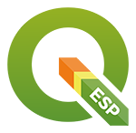

# 13as Jornadas de SIG libre (2019)

Las Jornadas de SIG libre son un punto de encuentro entre las personas que comparten un mismo interés: el uso y la promoción de los sistemas de información geográfica libres y los datos abiertos en el ámbito de la empresa, la Universidad y la Administración pública.

Es un espacio de aprendizaje donde compartir e intercambiar experiencias de casos prácticos y mostrar las novedades en el contexto de las tecnologías geoespaciales de código abierto.

* 29-30 de mayo de 2019
* Facultat de Lletres i de Turisme, Universitat de Girona

Sesión inaugural
==================

* **Presentación y apertura** Maria Pla de Solà-Morales (Vicerrectora de Investigación y Transferencia del Conocimiento de la UdG) y Gemma Boix (Directora del SIGTEUniversitat de Girona)

Ponencias plenarias
====================

* **Hello World: Tiny Satellites, Big Impact** Sara Safavi (Planet).
* **Repensar el futuro de las ciudades con la cartografía** Pablo Martínez (300.000km).
* **¡Sanguijuelas! Algunas ideas sobre el ecosistema de un SIG libre** Víctor Olaya (escritor y desarrollador SIG).

Comunicaciones
=================

Técnica avanzada
---------------------------

* **Hacia un modelo de datos abierto para inventarios de carreteras** Santiago Higuera **[Presentación]()** | **[Vídeo]()**
* **PointCloud processing con PDAL en QGIS** Luigi Pirelli **[Presentación]()** | **[Vídeo]()**
* **Cloud Optimized Geotiff:Usando Geotiff en remoto** Roger Veciana (Servei Meteorològic de Catalunya) **[Presentación]()** | **[Vídeo]()**
* **Airship** Oriol Boix (CARTO) **[Presentación]()** | **[Vídeo]()**

Casos de uso
---------------------------
* **Sistema GIS para el registro y gestión de parcelas de cultivo ecológico** Mikel Ayestaran Olano (Gislan) **[Presentación]()** | **[Vídeo]()**
* **Planificación y gestión del verde urbano con QGIS** Josep Lluís Sala Sanguino (BGEO) **[Presentación]()** | **[Vídeo]()**
* **GeoPortal en la Autoridad Portuaria de Gijón** Francisco Jose Campos, Francisco Jose Corral y Antonio Bello (Autoridad Portuaria de Gijón) **[Presentación]()** | **[Vídeo]()**
* **Clasificación de la Cobertura LiDAR 2017 de Navarra con Inteligencia Artificial y herramientas Open-source** Alvaro Huarte Sanz (TRACASA) **[Presentación]()** | **[Vídeo]()**

Open Data, IDE y Casos de uso
---------------------------
* **Geographical Information Systems for Spatio-Temporal Analysis of Mobile Networks in Barcelona** Francisco Sacramento Gutierres (Eurecat) **[Presentación]()** | **[Vídeo]()**
* **Infraestructura para unos datos enlazados abiertos y geográficos** Eduardo Martín Agúndez (CNIG) **[Presentación]()** | **[Vídeo]()**
* **IQUAview: una interfaz de usuario para operar vehículos submarinos basada en QGIS** Lluís Ribés Nebot, Natàlia Hurtós Vilarnau
(IQUA Robotics) **[Presentación]()** | **[Vídeo]()**
* **ICGCSolarRadiation: una metodología para determinar el potencial solar fotovoltaico y térmico en cubiertas de edificios** Assumpció Termens, Adriana Just,Ana Muñoz y Antonio Ruiz (ICGC) **[Presentación]()** | **[Vídeo]()**
* **Geocoder IDErioja** Gonzalo López García (IDErioja) **[Presentación]()** | **[Vídeo]()**
* **Desmitificación del metadato: Una oportunidad para la comunidad del software libre** Jordi Escriu (ICGC) **[Presentación]()** | **[Vídeo]()**

Proyectos colaborativos
---------------------------
* **Geochicas OSM** Carmen Diez Sanmartin, Jessica Sena, Montse Ortega, Eva M. López, Maria Soto y Esther Mingot (Geochicas OSM) **[Presentación]()** | **[Vídeo]()**
* **Las calles de las mujeres** Carmen Diez Sanmartin, Jessica Sena, Montse Ortega, Eva M. López, Maria Soto y Esther Mingot (Geochicas OSM) **[Presentación]()** | **[Vídeo]()**
* **Cómo sobrevivir a un apocalipsis zombie de gatitos (con OSGeo)** María Arias de Reyna (GeoCAT) **[Presentación]()** | **[Vídeo]()**
* **Procesos colaborativos de mejora de la calidad de los datos en OpenStreetMap** Esther Mingot y Jose Luís Infante (OSM-Cat) **[Presentación]()** | **[Vídeo]()**
* **Análisis de la accesibilidad urbana para personas con movilidad reducida a través del uso de IG voluntaria, cartografía colaborativa y herramientas libres** Ignacio Orte, Miguel Sevilla Callejo (Universidad de Zaragoza, IPE-CSIC), J.L. Infante (Llefianet Xarxa Ciutadana de Llefià), Carlos Cámara y Héctor Ochoa **[Presentación]()** | **[Vídeo]()**
* **Visor de mapas IDE y componente .NET basado en el API SITNA** Marc Roses Arbonés, Ricard Cots Torrelles, Marc Vinent Escandell (Consell Insular de Menorca) **[Presentación]()** | **[Vídeo]()**

Técnica avanzada
---------------------------
* **Asociación QGIS España. Hackfest A Coruña. Estado actual y objetivos 2019** Carlos López Quintanilla (QGIS-Es) **[Presentación]()** | **[Vídeo]()**
* **Webmapping vMap** Yoann Escorihuela (Veremes) **[Presentación]()** | **[Vídeo]()**
* **Atesmaps** Josep Ramisa y Roger Calaf (Atesmaps) **[Presentación]()** | **[Vídeo]()**
* **Mapa Base IGO** Gonzalo López García (IDErioja) **[Presentación]()** | **[Vídeo]()**

Mapas y visualización de datos – Investigación y proyectos académicos
------------------------------------------------------------------------------------------------------------
* **Mapa solar by idealista** David Francisco Gago (Idealista) **[Presentación]()** | **[Vídeo]()**
* **Distribución y visualización web en tiempo real de datos de adquisición continua en buques oceanográficos** J.L. Ruiz Valderrama, O.Domingo Adell (CSIC) **[Presentación]()** | **[Vídeo]()**
* **CARTOframes** Ernesto Martínez Becerra (CARTO) **[Presentación]()** | **[Vídeo]()**
* **Arqueoastronomía de eclipse de sol: generación de la geometría de la sombra de eclipses como arqueometría para dataciones históricas** J. Gómez Castaño, J. Cabrera García (INSPIDE) **[Presentación]()** | **[Vídeo]()**

Clausura
---------------------------
* **Datos geográficos abiertos para una sociedad abierta** Antonio Rodríguez (CNIG) **[Presentación]()** | **[Vídeo]()**
* **Preparémonos para cartografiar datos de accesibilidad** Carlos López Quintanilla (QGIS-Es) **[Presentación]()** | **[Vídeo]()**

Tutoriales
---------------------------
* **Aplicación de la norma española UNE 148004:2018** Antonio Rodríguez Pascual (CNIG)**[Presentación]()** | **[Vídeo]()**
* **Gestión municipal con gvSIG online** Nacho Muñoz Motilla **[Presentación]()** | **[Vídeo]()**
* **Publicación de recursos y herramientas GIS en la red** Antonio Murillo Estacho (Software Grupo S) **[Presentación]()** | **[Vídeo]()**

Talleres
========

* **Taller 1: Desarrollo de una aplicación web GIS** Adrián Pérez Beneito **[Presentación]()** | **[Vídeo]()**
* **Taller 2: Hands-on Satellite Imagery Analysis** Sara Safavi (Planet) **[Presentación]()** | **[Vídeo]()**
* **Taller 3: Herramientas avanzadas de edición y visualización de QGIS 3.4** Lluís Vicens (SIGTE) y Ferran Orduña (SIGTE) **[Presentación]()** | **[Vídeo]()**
* **Taller 3: CARTO-VL** Jorge Sanz (CARTO) **[Presentación]()** | **[Vídeo]()**
* **Taller 5: Procesamiento y visualización de datos Point-Cloud con PDAL y QGIS** Luigi Pirelli **[Presentación]()** | **[Vídeo]()**
* **Taller 6: Edición de datos OpenStreetMap** Miguel Sevilla-Callejo (Universidad de Zaragoza, IPE-CSIC) **[Presentación]()** | **[Vídeo]()**

Patrocinadores
==============

Colaboradores
==============

Agradecimientos
==============

