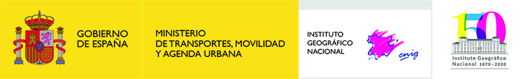

# 14as Jornadas de SIG libre (2021) - ONLINE

Las Jornadas de SIG libre son un punto de encuentro entre las personas que comparten un mismo interés: el uso y la promoción de los sistemas de información geográfica libres y los datos abiertos en el ámbito de la empresa, la Universidad y la Administración pública.

* 24-26 de marzo de 2020
* ONLINE

Sesión inaugural
==================

* **Bienvenida** Gemma Boix (Directora del SIGTE -Universitat de Girona) **[Vídeo](http://diobma.udg.edu/handle/10256.1/6193)**

Ponencia plenaria
====================

* **The economic impact of open geo data. Learnings for open-source software** Esther Huyer (Capgemini Invent), Antje Kügeler (con terra). **[Vídeo](http://diobma.udg.edu/handle/10256.1/6194)**

Comunicaciones
=================

Teledetección
---------------------------

* **Adquisición de imagenes satélite de alta resolución, ¡contacte con ventas!** Micho García (geomati.co). **[Vídeo](http://diobma.udg.edu/handle/10256.1/6195)**
* **How planet works** Ramiro Aznar (Planet) **[Vídeo](http://diobma.udg.edu/handle/10256.1/6196)**
* **Análisis cuantitativo de la isla de calor urbano para determinar niveles de confort térmico** Sara M. Boccolini (Centro de Investigaciones y Estudios sobre Economía y Sociedad) **[Vídeo](http://diobma.udg.edu/handle/10256.1/6197)**
* **Visualización de la actividad de caída de rocas mediante visor web de nube de puntos 3D** Oriol Pedraza Royo (Institut Cartogràfic i Geològic de Catalunya) **[Vídeo](http://diobma.udg.edu/handle/10256.1/6198)**
* **Edusat: imágenes de satélite del programa Copernicus como metodología de innovación docente** Carla García, Laura Olivas, Rosa Olivella (SIGTE - Universitat de Girona) **[Vídeo](http://diobma.udg.edu/handle/10256.1/6199)**
* **Freshwater Ecosystems explorer** Pere Roca Ristol (Joint Research Center -Ispra-) **[Vídeo](http://diobma.udg.edu/handle/10256.1/6200)**

Open Data
---------------------------

* **IDEO-GEOHIS una comunidad participativa para fuentes geohistóricas** Laura García Juan, Alejandro Vallina Rodríguez, Julio Fernández Portela, Miguel Angel Bringas (Universidad Autónoma de Madrid, UNED, Universidad de Cantabria) **[Vídeo](http://diobma.udg.edu/handle/10256.1/6201)**
* **Tropotresc** Victor Ferrer **[Vídeo](http://diobma.udg.edu/handle/10256.1/6202)**
* **El servicio para desarrolladores de Transports Metropolitans de Barcelona** Oscar Fonts, Francisco P. Sampayo, Sergio Edo i Eduard Porquet (geomati.co) **[Vídeo](http://diobma.udg.edu/handle/10256.1/6203)**
* **Generación de rutas óptimas a partir de Datos Abiertos y software libre** Cristina Calvo (Instituto Geográfico Nacional) **[Vídeo](http://diobma.udg.edu/handle/10256.1/6204)**

Desarrollos
---------------------------

* **Local Space - SIG Corporativo Municipal** Tereza Ivaylova Ilieva, Víctor Centella Fuster (Prodevelop) **[Vídeo](http://diobma.udg.edu/handle/10256.1/6205)**
* **Desarrollo de un planificador multimodal de rutas de transporte público sobre open trip planner** Diego Bujanda Bustillo (GeoActio) **[Vídeo](http://diobma.udg.edu/handle/10256.1/6206)**
* **qVista** Jordi Cebrián (Sistemas de Información Territorial Instituto Municiapal de Informática Ayuntamiento de Barcelona) **[Vídeo](http://diobma.udg.edu/handle/10256.1/6207)**
* **Mapa a la Carta, cartografía bajo demanda a medida de usuario** Celia Sevilla Sánchez (Centro Nacional de Información Geográfica - CNIG) **[Vídeo](http://diobma.udg.edu/handle/10256.1/6208)**
* **Mantenimiento y gestión avanzada de cartografía en gvSIG Desktop** Alvaro Anguix Alfaro, Mario Carrera Rodríguez (Asociación gvSIG) **[Vídeo](http://diobma.udg.edu/handle/10256.1/6209)**

Investigación
---------------------------
* **When Geometry meets Geography** Ramiro Aznar Ballarin (Planet) **[Vídeo](http://diobma.udg.edu/handle/10256.1/6210)**
* **Webmap de textos Neosumerios. La dispersión de tablillas cuneiformes por el mundo** Carlos Fernández Freire, Cristina Corral Sánchez, Manuel Molina Martos (Unidad SIGyHD - Centro de Ciencias Humanas y Sociales, CSIC) **[Vídeo](http://diobma.udg.edu/handle/10256.1/6211)**
* **La implementación del Observatório do Alto Tâmega. Desarrollo de un portal de inteligencia territorial** Marco Filipe Chaves Antunes (Universidade de Trás-os-Montes e Alto Douro / Comunidade Intermunicipal do Alto Tâmega) **[Vídeo](http://diobma.udg.edu/handle/10256.1/6212)**
* **Una propuesta metodológica a la iniciación a la gestión de proyectos TIG a través del software libre** Laura García Juan, Carmen Hidalgo Giralt, Angel Ignacio Aguilar Cuesta (Universidad Autónoma de Madrid, Universidad Internacional de Valencia)  **[Vídeo](http://diobma.udg.edu/handle/10256.1/6213)**   

Investigación
---------------------------

* **SIG libre para la sostenibilidad de la pesca en Catalunya** Joan Sala Coromina, Jordi Ribera Altimir, Jose Antonio García del Arco (Institut de Ciències del Mar - CSIC) **[Vídeo](http://diobma.udg.edu/handle/10256.1/6214)**
* **Cálculo de la exposición a espacios verdes urbanos con la librería de R greennessr** Jordi Segú Tell (Centro Nacional de Epidemiología - Instituto de Salud Carlos III)) **[Vídeo](http://diobma.udg.edu/handle/10256.1/6215)**
* **Uso de datos espaciales e implementación de aplicaciones en tiempos de la COVID19** Lluís Vicens (SIGTE - Universitat de Girona) **[Vídeo](http://diobma.udg.edu/handle/10256.1/6216)**
* **Hacia una representación cartografía topológica de los espacios urbanos** Núria Font Casaseca (Universitat de Barcelona) **[Vídeo](http://diobma.udg.edu/handle/10256.1/6217)**
* **Desarrollo de una tecnología Smartphone para el estudio del uso y la percepción del espacio público** Francisco Martín Rivas (Institut Cartogràfic i Geològic de Catalunya) **[Vídeo](http://diobma.udg.edu/handle/10256.1/6218)**
* **Análisis espacio-temporal de la vegetación en la mina de Barruecopardo** Eduardo Martín Azaola (GISARTE. GIS, Ingurumena & Remote Sensing SL) **[Vídeo](http://diobma.udg.edu/handle/10256.1/6219)**

Open Data / Crowdsourcing
------------------------------------------------------------------------------------------------------------
* **Integrando Flujos de Datos** María Arias de Reyna Domínguez (Red Hat) **[Vídeo](http://diobma.udg.edu/handle/10256.1/6220)**
* **CitMApp. Una aplicación libre al servicio de proyectos de ciencia ciudadana de carácter espacial** Miguel Sevilla-Callejo, Jorge Barba, Francisco Sanz, Victor Val, Jonatan Val, Daniel Bruno, Enrique Navarro (Instituto Pirenaico de Ecología - CSIC, Mapeado Colaborativo - Geoinquietos Zaragoza, Fundación Ibercivis) **[Vídeo](http://diobma.udg.edu/handle/10256.1/6221)**
* **Situando en el mapa las comunidades rurales de Burundi** Lucía Martínez Martínez (Cruz Roja Española) **[Vídeo](http://diobma.udg.edu/handle/10256.1/6222)**
* **Publicación de la cartografía topográfica municipal con herramientas de software libre** Esther Pulido Barberán (Ajuntament de Barcelona. Institut Municipal d'Informàtica) **[Vídeo](http://diobma.udg.edu/handle/10256.1/6223)**

Talleres/tutoriales
========================

* **Fotogrametría con drones y software de código abierto** Nil Sicart (MapsAndDrones) **[Vídeo](http://diobma.udg.edu/handle/10256.1/6222)**
* **Procesamiento de imágenes satélite con QGIS** Ferran Orduña , Carla Garcia-Lozano (SIGTE - Universitat de Girona) **[Vídeo](http://diobma.udg.edu/handle/10256.1/6234)**
* **QGIS. Vistas y mapas que cambian con el tiempo** Carlos López (PSIG) **[Vídeo](http://diobma.udg.edu/handle/10256.1/6235)**
* **¿Cómo se hacen los mapas? La tecnología open source detrás de ellos** Manuel Jesús Morillo Jiménez (CARTO) **[Vídeo](http://diobma.udg.edu/handle/10256.1/6236)**
* **QGIS Full Motion Video** Francisco Raga Lopez (All4Gis) **[Vídeo](http://diobma.udg.edu/handle/10256.1/6237)**
* **API CNIG** José María Garcia Malmierca (CNIG) **[Vídeo](http://diobma.udg.edu/handle/10256.1/6238)**
* **Visualización avanzada de mapas con Deck.gl** Adrián Pérez Beneito (CARTO) **[Vídeo](http://diobma.udg.edu/handle/10256.1/6239)**
* **Visores Web Mapping** Javier Gabás (geopois.com) **[Vídeo](http://diobma.udg.edu/handle/10256.1/6240)**
* **Calculando rutas indoor con Python** Pedro Juan Ferrer (CARTO) y Cayetano Benavent (CARTO) **[Vídeo](http://diobma.udg.edu/handle/10256.1/6241)**
* **Análisis Geoespacial con CARTOframes** Pablo Fernández Moniz, Miguel Moncada (CARTO) **[Vídeo](http://diobma.udg.edu/handle/10256.1/6242)**

Colaboradores
==============

