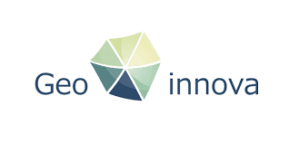
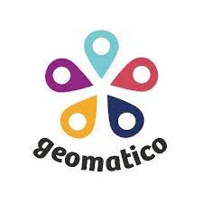
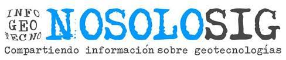

# 15as Jornadas de SIG libre (2022)

Las Jornadas de SIG libre son un evento de referencia donde se comparte el conocimiento de las tecnologías libres del sector geoespacial. Un punto de encuentro y de unión entre empresas, Universidades y la Administración pública.

Es un espacio de aprendizaje donde se muestran las últimas novedades de las tecnologías geoespaciales de código abierto.

* 8-9 de junio de 2022
* Facultat de Lletres i de Turisme, Universitat de Girona

Sesión inaugural
==================

* **Presentación y apertura** Maria Pla de Solà-Morales (Vicerrectora de Investigación y Transferencia del Conocimiento de la UdG) y Gemma Boix (Directora del SIGTE-Universitat de Girona). **[Vídeo](http://diobma.udg.edu/handle/10256.1/6772)**

Ponencias plenarias
====================

* **Inteligencia artificial. Retos y oportunidades** Karina Gibert (IDEAI-UPC). **[Vídeo](http://diobma.udg.edu/handle/10256.1/6773)**
* **Afrontar la emergencia climática. Ciencia y tecnología para monitorizar el presente y predecir el futuro** Laia Romero (Lobelia). **[Vídeo](http://diobma.udg.edu/handle/10256.1/6774)**
* **Las trincheras del FOSS** María Arias de Reyna Domínguez (Red Hat). **[Vídeo](http://diobma.udg.edu/handle/10256.1/6775)**

Comunicaciones
=================

Visualización de datos
---------------------------

* **Teselas, Demers y los datos geoclimáticos de la ONU** Xaquin Veira, Karma Perió (Fundació Vit), Anton Bardera (Imae). **[Vídeo](http://diobma.udg.edu/handle/10256.1/6776)**
* **Geología en teselas vectoriales. Desarrollo del visor Mapa Geológico de Catalunya 1:25.000** Elena Sánchez Monforte, Lucía Struth Izquierdo, Eulàlia Pi i Palomés, Miquel Vilà i Planella, Fus Micheo Jorcano, Jorge Fleta Pastor (Institut Cartogràfic i Geològic de Catalunya). **[Vídeo](http://diobma.udg.edu/handle/10256.1/6777)**
* **Cómo se hizo Catastro 3D, un caso de visualización avanzada de datos vectoriales** Francisco Pérez Sampayo, Oscar Fonts Bartolomé (geomatico.es). **[Vídeo](http://diobma.udg.edu/handle/10256.1/6778)**
* **Portal de geodatos del ámbito marítimo del Baix Empordà** Rosa Olivella, Toni Hernández (SIGTE-Universitat de Girona), Carolina Martí (Institut de Medi Ambient - Universitat de Girona). **[Vídeo](http://diobma.udg.edu/handle/10256.1/6779)**
* **Visualización de datos espaciales en humanidades digitales** Lourdes Martín-Forero Morente, Isabel Del Bosque González, Carlos Fernández Freire, Nuria Hermida Jiménez (Centro de Ciencias Humanas y Sociales. CSIC).

Desarrollos
---------------------------
* **Teselas vectoriales con Elasticsearch** Jorge Sanz (Elastic). **[Vídeo](http://diobma.udg.edu/handle/10256.1/6789)**
* **Desarrollo de herramientas para la automatización de flujos de trabajo: plug-in de QGIS y microaplicación web** Fran Martín Rivas (Institut Cartogràfic i Geològic de Catalunya). **[Vídeo](http://diobma.udg.edu/handle/10256.1/6790)**
* **Buenas prácticas en los SIG municipales. Solución Local Space** Víctor Centella Fuster (Prodevelop). **[Vídeo](http://diobma.udg.edu/handle/10256.1/6791)**
* **Posibles soluciones al trabajar con grandes volúmenes de datos** Josep Sitjar (SIGTE-Universitat de Girona). **[Vídeo](http://diobma.udg.edu/handle/10256.1/6792)**
* **Generador de visores de mapas sobre librerías JS Leaflet y OSMBuildings vía APEX** Sergi Bernal Ferrando, Beatriu Jimenez (Ajuntament de Mataró). **[Vídeo](http://diobma.udg.edu/handle/10256.1/6793)**

Casos de uso
---------------------------
* **Un viral en la pandemia: el making-of** Marti Pericay, Micho García (Geomatico).
* **Ciencia de las ciudades al servicio del diseño y planificación urbana para la toma de decisiones informadas: casos de estudio** Jose Antonio Gras Iñigo (OUA Group / Universitat Oberta de Catalunya), Alexandre Gauthier Amigó (OUA Group), Alba Carbonell Masagué (OUA Group). **[Vídeo](http://diobma.udg.edu/handle/10256.1/6801)**
* **Programa de itinerarios deportivos de proximidad: desarrollo e implantación del sistema de información geográfica** Xavier Navalon Nonell, Gerard Xixons Solé (Diputació de Barcelona).
* **Uso de los SIG para evaluar la compensación de los impactos residuales y la pérdida de biodiversidad en instrumentos de planeamiento** David Barreto Expósito, Sandra Núñez Malavé, Martín Portilla Cardona, Gloria Sabaté Fernández, Omar Sosa García y Alberto Zaragoza i Talamantes (COLECTIVO CCRS). **[Vídeo](http://diobma.udg.edu/handle/10256.1/6802)**
* **PostGIS y QGIS aplicados a la optimización de la ubicación y la gestión integral del proceso para la implementación de parques solares fotovoltaicos en Catalunya** Xavier Torret (BGEO, OPEN GIS). **[Vídeo](http://diobma.udg.edu/handle/10256.1/6803)**
* **Planero Web. Un visor en línea interactivo para la difusión de cartografía digital** Patricio Soriano Castro (Geoinnova). **[Vídeo](http://diobma.udg.edu/handle/10256.1/6804)**
* **Uso de PostgreSQL, QGIS y R para estudiar las interacciones entre la actividad de las barcas de pesca y los movimientos espaciales de un depredador marino oportunista** José Antonio García del Arco, Miriam Gimeno Castells, Joan Navarro Bernabé (Instituto de Ciencias del Mar de Barcelona, ICM-CSIC). **[Vídeo](http://diobma.udg.edu/handle/10256.1/6805)**
* **Comercio cotidiano con servicio básico** Mikel Pau Casado Buesa, Cristina Poza Lopez (Col·lectiu d'Arquitectes el Tinglado / Universitat Autonoma de Barcelona). **[Vídeo](http://diobma.udg.edu/handle/10256.1/6806)**
* **Nombre a nombre: Solución geomática para la recogida e inventario de toponimia** Marc Rosés Arbonés (SILME, SA), Ricard Cots Torrelles (Consell Insular de Menorca), Xavier Gomila Pons (Institut Menorquí d’Estudis). **[Vídeo](http://diobma.udg.edu/handle/10256.1/6807)**

Teledetección
---------------------------
* **Desafíos de la migración desde el catálogo interno de imágenes de satélite en el catálogo SpatioTemporal Asset Catalog (STAC)** Luigi Pirelli (Satellogic). **[Vídeo](http://diobma.udg.edu/handle/10256.1/6780)**
* **Complemento de QGIS para el proceso de datos ráster en remoto** Daniel Ponsa Mussarra, Felipe Lumbreras Ruiz, Robert Benavente Vidal (Centre de Visió per Computador). **[Vídeo](http://diobma.udg.edu/handle/10256.1/6781)**
* **Seguimiento de la tasa de mortalidad de los árboles en un bosque tropical húmedo mediante LiDAR aéreo multitemporal empleando software libre** Claudia Huertas Garcia (IRD - France). **[Vídeo](http://diobma.udg.edu/handle/10256.1/6782)**
* **El estado del Planeta** Ramiro Aznar Ballarin (Planet). **[Vídeo](http://diobma.udg.edu/handle/10256.1/6783)**
* **Monitoreo de desiertos submarinos mediante drones y ciencia ciudadana**
Teresa Alcoverro, Emma Cebrián, Bernat Hereu, Joaquim Garrabou, Jordi Boada, Fernando García (CEAB-CSIC). **[Vídeo](http://diobma.udg.edu/handle/10256.1/6784)**

IDEs y Geoportales
---------------------------
* **Geoportal del centro de datos de la UTM-CSIC** Xavier Rayo Sarrias, Susana Diez Tagarro, Guillermo Farriga Infante, Elsa Martinez Abad, Juan Luis Ruiz Valderrama, Antonio Tomás Franco (Centro de Datos de la Unidad de Tecnología Marina del CSIC). **[Vídeo](http://diobma.udg.edu/handle/10256.1/6794)**
* **Cuando una IDE que facilita los procedimientos administrativos** Ricard Cots Torrelles (Consell Insular de Menorca), Marc Rosés Arbonés (SILME, servei informàtica local de Menorca). **[Vídeo](http://diobma.udg.edu/handle/10256.1/6795)**
* **Mapa a la Carta v.2: Nuevas funcionalidades y productos** Pablo Domingo Gómez, Celia Sevilla Sánchez (Centro Nacional de Información Geográfica - CNIG). **[Vídeo](http://diobma.udg.edu/handle/10256.1/6796)**
* **SITMUN, una oportunidad para la comunidad SIG libre** Ricard Cots Torrelles (Consell Insular de Menorca), Fina Saez (Diputació de Barcelona), Javier López (Universitat de Saragossa), Marc Rosés Arbonés (SILME), Gemma Peix Dordas (Diputació de Girona). **[Vídeo](http://diobma.udg.edu/handle/10256.1/6797)**
* **IDE del Instituto Hidrográfico de la Marina. Integración específica de API-CNIG** Enrique Soriano, Daniel Luna (Guadaltel).

Open data
------------------------------------------------------------------------------------------------------------
* **Datos Geoespaciales en la web (en la era de REST, JSON y OpenAPI)** Joana Simoes (Open Geospatial Consortium - OGC). **[Presentación](https://docs.google.com/presentation/d/1aDYpCKAdbIyGefetrM7tiguIyfTbUPpW/edit#slide=id.p2)** | **[Vídeo](http://diobma.udg.edu/handle/10256.1/6785)**
* **Digitalización de la Distribución Urbana de Mercancías (DUMCAT)** Jordi Martin Oriol, Maria José Gaete Cerda (Autoritat del Transport Metropolità de Barcelona). **[Vídeo](http://diobma.udg.edu/handle/10256.1/6786)**
* **Servicios Teselados en el CNIG: TMS y MVT** Cecilia Poyatos Hernández, Aurelio Aragón Velasco, Marta Juanatey Aguilera (CNIG). **[Vídeo](http://diobma.udg.edu/handle/10256.1/6787)**
* **Propuesta para el desarrollo de una plataforma de mercado para un sistema SIG basado en métodos numéricos** Laurence Sigler (CIMNE/UPC). **[Vídeo](http://diobma.udg.edu/handle/10256.1/6788)**

Cartografía colaborativa
------------------------------------------------------------------------------------------------------------
* **Crear información geográfica colaborativa transaccional en urbiGIS** Ignacio Arnaiz Eguren (Arnaiz Urbimática SL). **[Vídeo](http://diobma.udg.edu/handle/10256.1/6798)**
* **MapAnt ES: Un mapa de orientación autogenerado de España** Manuel Jurado Alonso, Agustín Caballero Belda (Club Orientación Sant Joan), Javier Arufe Varela (Federación Española de Orientación - FEDO), Jesús María Garrido Sáenz de Tejada, Jesús Moreno Jabato (Instituto Geográfico Nacional - IGN). **[Vídeo](http://diobma.udg.edu/handle/10256.1/6799)**
* **Mapas colaborativos de accesibilidad, arbolado y perspectiva de género en Badalona** Jose Luis Infante Arco (Llefi@net Xarxa Ciutadana de Llefià). **[Vídeo](http://diobma.udg.edu/handle/10256.1/6800)**

Clausura
---------------------------
* **Sesión de clausura: La UE y datos (regulación). ¿Una nueva historia de amor?** Malcolm Bain (Across Legal). **[Vídeo](http://diobma.udg.edu/handle/10256.1/6809)**

Tutoriales
---------------------------
* **Acceso directo a la geoinformación de Catalunya en QGIS con el conector OpenICGC** Joan Arnaldich (Institut Cartogràfic i Geològic de Catalunya).
* **API-CNIG, la evolución** Aurelio Aragón Velasco (CNIG).
* **Cálculo de rutas óptimas con pgRouting en entornos web** Toni Hernández (SIGTE-UdG).
* **ContextMaps: el nuevo referente de cartografía transversal del Institut Cartogràfic i Geològic de Catalunya**
Rocío Rey, Francisco Campo, Victor Pasqual (Institut Cartogràfic i Geològic de Catalunya). **[Vídeo](http://diobma.udg.edu/handle/10256.1/6808)**

Talleres
========

* **Taller 1: Elasticsearch y Kibana geoespacial** Jorge Sanz (Elastic). **[Presentación](https://docs.google.com/presentation/d/e/2PACX-1vRIseaVkvIjJsCx4PD5jALMayG3t80ppRfzK4Kkfo3twClH3JvcPC-arezqrjgzc3URy4oBwgeGfxwg/pub?start=false&loop=false&delayms=60000&slide=id.g1287f720363_1_22)**
* **Taller 2: Introducción a deck.gl para visualización geoespacial** Borja Muñoz (Carto).
* **Taller 3: Introducción al análisis exploratorio de datos espaciales con GeoDa** Lluís Vicens (SIGTE). [Presentación](https://docs.google.com/presentation/d/1novzo2vYO0m8AeHanivZ_IZUTrNIJpbnC1So7FYwLnw/edit#slide=id.p) | [Datos](data/GEODA_JSL.gpkg)
* **Taller 3: Cómo crear una API rest para publicar datos geoespaciales** Joana Simoes (ByteRoad). **[Presentación](https://docs.google.com/presentation/d/1xjvZERpNq8QPvh-I8lY99-cWXCgC654AfC3hJKD0ESI/edit#slide=id.p1)**
* **Taller 5: Obtención de datos SIG con dron y software libre** Nil Sicart (4D Twin Maps).
* **Taller 6: Visualización de datos con herramientas de QGIS** Santi H. Puig (freelance) y Laura Olivas (SIGTE-UdG). **[Presentación](https://bit.ly/tallerdataviz)**

Patrocinadores
==============

 

 

 

 

 

 

Colaboradores
==============

 

 

 

 

 

 

 

Medios de comunicación
==============

 

 
