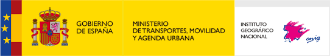
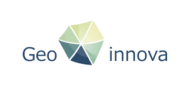
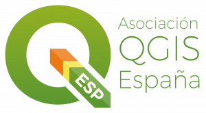

# 16as Jornadas de SIG libre (2023)

Las tecnologías de la información geográfica se actualizan a una velocidad sin precedentes. Cada vez más, nuevas herramientas salen a la luz para facilitar nuestro día a día y aumenta la demanda de perfiles más técnicos como el *Spatial Data Scientist*. Las Jornadas de SIG Libre son un evento donde se congrega a todo el sector *Geotech* para discutir y aprender de las nuevas tendencias de nuestro ámbito.

Este año, los temas que se han abordado son la visualización de datos, el análisis espacial, el desarrollo de *software* y aplicaciones, *webmapping*, observación de la Tierra, ciencia de datos, geoestadística, *machine learning*, datos abiertos, etc.

* 14-15 de junio de 2023
* Facultat de Lletres i de Turisme, Universitat de Girona

Sesión inaugural
==================

* **Presentación y apertura** Gemma Boix (Directora del SIGTE-Universitat de Girona). **[Vídeo]()**

Ponencias plenarias
====================

* **GIS con R. Perspectivas en el contexto de Open Data y Open Software** Dominic Royé. **[Vídeo]()**

Comunicaciones
=================

* **Plataforma smart city para analizar el consumo energético de los edificios. El caso del Prat de Llobregat** Juan David Cermerón (Ayuntamiento del Prat de Llobregat), Estefanía Hernández (Nexus Geographics). **[Presentación](data/pdf/comunicaciones/PlataformaSmart_PratLlobregat_EH_JC.pdf)**
* **¿Cómo pasar de un atlas en papel a un atlas web interactivo?** Héctor Ochoa Ortiz, María Teresa Baquero Larriva, Sindi Haxhija, David Telmo Durán Rodas (Universidad Politécnica de Madrid). **[Presentación](data/pdf/comunicaciones/ComoPasarAtlasPapelAatlasInteractivo.pdf)**
* **Cosas que puedes hacer con PostGIS y que quizás no sepas** Xavier Torret, Albert Bofill, Barbara Rzepka, David Erill (Giswater). **[Presentación](data/pdf/comunicaciones/CosasQuePuedesHacerConPostgis.pdf)**
* **Las capas de un stack de datos geoespaciales** Ramiro Aznar Ballarin (Planet). **[Presentación](data/pdf/comunicaciones/capas_De_un_Stack_de_datos_geoespaciales.pdf)**
* **Los mapas web como soporte a procesos de participación y ciencia ciudadana** Rosa Olivella y Josep Sitjar (SIGTE).
* **Análisis del vigor de árboles a través un gradiente altitudinal mediante imágenes multiespectrales UAV** Jose Luis Gallardo-Salazar, Cuauhtémoc Sáenz-Romero, Roberto Lindig-Cisneros, Leonel López-Toledo, Ángel Rolando Endara-Agramont, José Arnulfo Blanco-García (Universitat Michoacana México). **[Presentación](data/pdf/comunicaciones/Comunicaci%C3%B3n_GIRONA_JLGS.pdf)**
* **CatLC: Datos abiertos en multi-resolución para la generación de productos y cubiertas del suelo con IA** Assumpció Termens, Anna Tardà, Lydia Pineda, Oscar Mora (ICGC). **[Presentación](data/pdf/comunicaciones/CatLC_siglibre2023.pdf)**
* **Tecnología Visual para el agricultor** Manel Alemany Martinez, Marcela Pereira-Sandoval (VisualNacert, S.L). **[Presentación](data/pdf/comunicaciones/Tecnologia_Visual_para_el_Agricultor.pdf)**
* **Deep learning para detección de cultivos con imágenes PNOA: el caso de cultivos vitícolas** Juan Ignacio Varela García, Marcos Eimil Pardo
* **Mejorando la gestión de fotogramas aéreos: actualización de la fototeca del ICV** Víctor Centella Fuster, Pau Pérez Puigcerver, Elena Esteso Moya, Luis Dueñas Domingo, Raquel Fernández Martínez (Prodevelop)
* **Geografía de los commons: el caso de la agricultura comunitaria en Ámsterdam** Marc Bosch Matas (Knowledge Sharing Network). **[Presentación](data/pdf/comunicaciones/GeografiaDeLosCommons.pdf)**
* **Gestión de operaciones y mantenimiento de redes de agua y alcantarillado mediante solución Giswater** Josep Portero Garro, Ferran Guri Feliu, Albert Besora Magem, Albert Bofill (Aigües Mataró). **[Presentación](data/pdf/comunicaciones/OM_GISWATER%20SIGTE.pdf)**
* **OGCAPI en APICNIG** Aurelio Aragón Velasco, Yaiza Gómez Espada (CNIG). **[Presentación](data/pdf/comunicaciones/yaiza_gomez_apicnig.pdf)**
* **Gleo: la nueva librería de mapas web que intenta domar WebGL** Iván Sánchez Ortega
* **Novedades de QGIS (desde la 3.24 hasta la 3.32)** Carlos Lopez (PSIG)
* **Cuando las teselas vectoriales no bastan: casos de aplicación de deck.gl en el mundo real** Oscar Fonts, Francisco Pérez (Geomático). **[Presentación](data/pdf/comunicaciones/Geomatico_DeckGL.pdf)**
* **URBAN3R. Plataforma de datos abiertos para impulsar la regeneración urbana en España** Guillem Herrera Masabeu (Cíclica arquitectura), Teresa Monzó Fita (Cíclica arquitectura). **[Presentación](data/pdf/comunicaciones/Urban3rPresentacio.pdf)**
* **Nuevos formatos abiertos de distribución del mapa topográfico metropolitano 1:1.000 (MTM-1M) de la AMB** Montserrat Monteagudo Gómez (AMB), David Ramos (AMB). **[Presentación](data/pdf/comunicaciones/SIGLIBRE_AMB_Formatos_Abiertos_MTM1M.pdf)**
* **Clasificación de cultivos y cubiertas forestales de Navarra con Sentinel-1, Sentinel-2 y LiDAR** Gabriel Bonifaz, Itxaso Aranguren Erice, Jesús Álvarez Mozos, María González de Audícana (Universidad Pública de Navarra, Instituto de Innovación y Sostenibilidad en la Cadena Alimentaria). **[Presentación](data/pdf/comunicaciones/capas_De_un_Stack_de_datos_geoespaciales.pdf)**

Lightning talks
---------------------------
* **Análisis del riesgo por movimientos del terreno en QGIS/PostGIS** Jordi Marturia, Ivan Fabregat, Pere Buxó, Carlos Lopez (ICGC). **[Presentación](data/pdf/lightning_talks/Analisis_riesgo_por_movimientos_del_Terreno.pdf)**
* **Estimación de biomasa área forestal mediante información satelital MODIS y Landsat 8** Marcela Rosas-Chavoya, Pablito Marcelo López-Serrano, Daniel José Vega-Nieva, José Ciro Hernández-Díaz, Christian Wehenkel, José Javier Corral-Rivas (Universidad Juárez del Estado de Durango). **[Presentación](data/pdf/lightning_talks/Estimacion_biomasa_aerea_forestal.pdf)**
* **Gestionar geoportales con QGIS** Gerald Kogler (PSIG)
* **IRRITER: software web a medida para gestión de riego de precisión** Oscar Fonts, Marti Pericay (Geomático). **[Presentación](data/pdf/lightning_talks/Geomatico_Irriter.pdf)**
* **Las científicas en las calles y escuelas de Catalunya** Miquel Duran portas, Sílvia Simon Rabasseda, Cristina Berga Domínguez, Eva Cabré Sedó, Martina Rodríguez Santander (UdG). **[Presentación](data/pdf/lightning_talks/Las_cientificas_de_las_calles_de_catalunya.pdf)**
* **Nueva IDE del Ayuntamiento de Palma** Victor Centella Fuster, Tereza Ivaylova Ilieva, Enric Gimeno Vilanova, Tomeu Crespí Seguí, Fernando Tomás Vidal Nadal (Prodevelop). **[Presentación](data/pdf/lightning_talks/IDE_Palma.pdf)**
* **SIG para la elaboración de un catálogo de bienes patrimoniales** David Barreto Expósito, Sandra Núñez Malavé, Martín Portilla Cardona, Gloria Sabaté Fernández, Omar Sosa García, Alberto Zaragoza Talamantes (Colectivo CCRS). **[Presentación](data/pdf/lightning_talks/J_SIG_Libre_2023_CCRSxs.pdfSIGCatalogoBienesPatrimoniales.pdf)**
* **SIGPAC Downloader, el plugin de QGIS para parcelas agrícolas** Francisco Pérez, Marti Pericay (Geomático). **[Presentación](data/pdf/lightning_talks/Geomatico_SIGPACDownloader.pdf)**
* **Visor de perfiles de velocidad del sonido geoposicionados** Xavier Rayo Sarrias, Susana Diez Tagarro, Guillermo Garriga Infante, Elsa Martinez Abad, Juan Luis Ruiz Valderrama (CSIC - Marine Technology Unit). **[Presentación](data/pdf/lightning_talks/VisorPerfilesVelocidadSonido.pdf)**
* **El mapa del mosquito tigre. ¿Dónde está picando?** Toni Hernández (SIGTE - Universitat de Girona)

Talleres
========

* **Taller 1: Web mapping con Elasticsearch** Jorge Sanz (Elastic). **[Presentación]()**
* **Taller 2: Análisis de imágenes de satélite con Python y técnicas de inteligencia artificial** Alberto Labarga (Universidad Politécnica de Navarra).
* **Taller 3: La accesibilidad como un indicador de injusticia en la movilidad** Héctor Ochoa Ortiz, David Telmo Durán Rodas, María Teresa Baquero Larriva, Sindi Haxhija (Cátedra de Estructura Urbana y Planificación del Transporte, Universidad Técnica de Múnich, Alemania). **[Presentación](data/pdf/talleres/Workshop_Accesibilidad.pdf)**
* **Taller 4: Taller de formularios dinámicos en QGIS** Carlos Lopez (PSIG). **[Presentación]()**
* **Taller 5: QGIS para el análisis espacial y la visualización de indicadores estadísticos en deportes de equipo** Mikel Becerro, Marc Oller Garcia. **[Datos](data/DATASETS_TALLER_HOCKEY.zip)**
* **Taller 6: Python como un SIG** Biel Stela (Vizzuality). **[Presentación]()**
* **Taller 7: OpenDroneMap para fotogrametría digital con drones** Jose Luis Gallardo-Salazar, Marcela Rosas-Chavoya (Instituto de Investigaciones Agropecuarias y Forestales, Universidad Michoacana de San Nicolás de Hidalgo). **[Presentación](data/pdf/talleres/Taller_OpenDroneMap.pdf)**
* **Taller 8: Índices espaciales. Nuevo paradigma para trabajar con big data** Pedro-Juan Ferrer Matoses, Cayetano Benavent Viñuales (CARTO). **[Presentación](data/pdf/talleres/Spatial_Indexes_New_paradigm_for_working_with_Big_Data.pdf)**

Patrocinadores
==============

 

 

 

 

 

 

Colaboradores
==============

 

 

 

 

 

 

 

