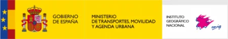
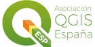
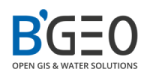
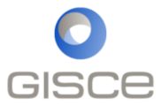

# 17as Jornadas de SIG libre (2024)

Las tecnologías de la información geográfica se actualizan a una velocidad sin precedentes. Cada vez más, nuevas herramientas salen a la luz para facilitar nuestro día a día y aumenta la demanda de perfiles más técnicos como el *Spatial Data Scientist*. Las Jornadas de SIG Libre son un evento donde se congrega a todo el sector *Geotech* para discutir y aprender de las nuevas tendencias de nuestro ámbito.

Este año, los temas que se han abordado son la visualización de datos, el análisis espacial, el desarrollo de *software* y aplicaciones, *webmapping*, observación de la Tierra, ciencia de datos, geoestadística, *machine learning*, datos abiertos, etc.

* 12-13 de junio de 2024
* Facultat de Lletres i de Turisme, Universitat de Girona

Sesión inaugural
==================

* **Presentación y apertura** Gemma Boix (Directora del SIGTE-Universitat de Girona). **[Vídeo](https:)**

Ponencias plenarias
====================

* **Visualización y transparencia de datos** Carmen Torrecillas. **[Presentación]()** | **[Vídeo]()**
* **Ética y economia: ¿son viables los proyectos geoespaciales de software libre?** Angelos Tzotzos (OSGeo), Josep Lluís Sala (BGEO), Oscar Fonts (Geomatico), Iván Sánchez. **[Presentación]()** | **[Vídeo]()**

Comunicaciones
=================

* **Uso de una red neuronal convolucional (CNN) para mejorar la definición de la capa de núcleos del ICGC** Anna Monrabà (BGEO). **[Presentación]()** | **[Vídeo]()**
* **Desarrollo de técnicas de validación cruzada espacial en el paquete de R CAST** Carles Mila (isglobal). **[Presentación]()** | **[Vídeo]()**
* **IA4GEO. Detección de cambios en ortoimágenes** Adrián Fernández Gutiérrez (Seresco). **[Presentación]()** | **[Vídeo]()**
* **Adquisición automática de datos de vialidad, para la actualización del callejero del AMB** Bernat Pallares (AMB), Martín Bueso (AMB), Montserrat Monteagudo (AMB). **[Presentación]()** | **[Vídeo]()**
* **Implementación de un software para el cálculo y visualización del contenido de humedad del combustible vivo para la prevención y gestión integral de incendios forestales en la Comunitat Valenciana** Carles Boïls, Kenneth Pachacama-Vallejo, Ángel Balaguer-Beser, José L. Soriano-Sancho. **[Presentación]()** | **[Vídeo]()**
* **Indicadores geográficos para la planificación sostenible: explorando casos de estudio en análisis urbano, planificación territorial y gestión de un patrimonio mundial** Patricio Soriano (Geoinnova), Luis Quesada (Geoinnova). **[Presentación]()** | **[Vídeo]()**
* **Mapas base locales. La alternativa OpenSource+OpenData. Implementación y configuración rápida** Jose Macchi. **[Presentación]()** | **[Vídeo]()**
* **Windtec Interface: plataforma de datos de medición eólica** Lluís Tartera (nexus geographics), Xavier Barnada (nexus geographics), Arturo Ramo (Windtec Energia), Francisco Huggins (Windtec Energia). **[Presentación]()** | **[Vídeo]()**
* **¡No more normativa, por favor!** Malcolm Bain (Acrosslegal). **[Presentación]()** | **[Vídeo]()**
* **Edición local de archivos geográficos en aplicaciones web con API SITNA** Fernando Lacunza (Tracasa). **[Presentación]()** | **[Vídeo]()**
* **MapICGC GL JS: una nueva librería open source para la visualización de vector tiles y 3D tiles** Lucia Struth (ICGC), Victor Pascual (ICGC). **[Presentación]()** | **[Vídeo]()**
* **MapTiler SDK, la experiencia MapLibre con esteroides** Wladimir Szczerban (Maptiler). **[Presentación]()** | **[Vídeo]()**
* **El desarrollo de las API de OGC en el CNIG** Patricia Perelló (CNIG), Cecilia Poyatos (CNIG), Maria José García (CNIG), Gloria Andrés (CNIG). **[Presentación]()** | **[Vídeo]()**
* **Quick Web Viewer: ¡queremos más mapas online!** Pablo Martínez (300000kms), Gerald Kogler. **[Presentación]()** | **[Vídeo]()**
* **Método y plugin de QGIS para conectar los edificios con la red de alcantarillado** Josep Pueyo-Ros (UdG). **[Presentación]()** | **[Vídeo]()**
* **Creación de terrazas de bar con PostGIS en la ciudad de Barcelona** Carlos López Quintanilla (PSIG). **[Presentación]()** | **[Vídeo]()**
* **Presionando al Estado con webmapping y ciencia de datos: una arquitectura con tecnologías geoespaciales libres para la atención de problemas sociales en León (Guanajuato, México)** Sebastián Alejandro (UGTO), Claudia Teresa Gasca (UGTO), Aquiles Omar (UGTO). **[Presentación]()** | **[Vídeo]()**
* **El interior de un Geopackage: el caso del Proyecto DRAIN** Maria Guzmán (BGEO). **[Presentación]()** | **[Vídeo]()**
* **Misión exploratoria de visualización raster serverless: COG en Maplibre y más allá** Oscar Fonts (Geomatico), Francisco P. Sampayo (Geomatico). **[Presentación]()** | **[Vídeo]()**
* **Aplicaciones de QGIS y Geonode a la investigación histórica** Orestes Sanchez (Arxiu històric Poblenou), Enrique Tàrrega (Arxiu històric Poblenou). **[Presentación]()** | **[Vídeo]()**

Lightning talks
---------------------------

* **¿Cómo descifrar los retos del futuro agrario a través de los datos? El uso de GeoDa como herramienta de análisis geoespacial** Daniel Farré (DiBA), Maria Torres (UdG). **[Presentación]()** | **[Vídeo]()**
* **Open data y resiliencia comunitaria** Lucía Martínez (Cruz Roja). **[Presentación]()** | **[Vídeo]()**
* **¿OSM y Administración Pública? Sí, se puede** José Manuel Vázquez. **[Presentación]()** | **[Vídeo]()**
* **SCANEO, aplicación de etiquetado inteligente de datasets de entrenamiento para modelos de IA aplicados a datos satelitales** Fran Martín Rivas (earthpulse). **[Presentación]()** | **[Vídeo]()**
* **BSEQ, herramienta para el análisis y control de la sequía** David Cano (BGEO). **[Presentación]()** | **[Vídeo]()**
* **Visor de corrientes oceanográficas ICATMAR** Gerard Llorach (CSIC), Lucía Quirós-Collazos (CSIC), Cristina González (CSIC), Emilio García-Ladona (CSIC), Jordi Isern (CSIC). **[Presentación]()** | **[Vídeo]()**
* **Integración y visualización de datos urbanos: el visor del Colegio Oficial de Arquitectos de Córdoba** Eva Rabasco (Geoinnova). **[Presentación]()** | **[Vídeo]()**
* **PostgREST – Convierte tu base de datos PostGIS en una API REST** Jordi Segú (Tragsa), Maria Valdezarte (Tragsa). **[Presentación]()** | **[Vídeo]()**
* **Fleet: aplicación de visualización y consulta de datos del underway de buques oceanográficos en tiempo real** Xavier Rayo (CSIC), Juan Luis Ruiz (CSIC). **[Presentación]()** | **[Vídeo]()**
* **Plan litoral: plan estratégico de los espacios litorales de la ciudad de Barcelona** Jordi Cebrián (Ajuntament de Barcelona), Lucia Cuesta (Ajuntament de Barcelona), Laia Igual (Nexus Geographics), Lluís Tartera (Nexus Geographics). **[Presentación]()** | **[Vídeo]()**
* **Geocamp y comunidades GEO** Carmen Díez, Francisco Pérez Sampayo, Jorge Sanz. **[Presentación]()** | **[Vídeo]()** 

Talleres
========

* **Taller 1: Conceptos básicos de GDAL/OGR para el procesamiento de imágenes satelitales** Lorenzo Becchi.
* **Taller 2: Cómo montar una aplicación geoespacial con datos en tiempo real de una hora con Tinybird** Raquel Barbadillo (Desarrolladora en Tinybird).
* **Taller 3: Felt, QGIS y Jupyter notebooks: mapas colaborativos para todo el mundo** Isaac Besora (Felt).
* **Taller 4: Introducción al análisis geográfico con librerías Python** Miquel Febrer (Geoinnova).
* **Taller 5: SPAI como framework de desarrollo de aplicaciones basadas en datos satelitales e inteligencia artificial** Fran Martín Rivas (Earthpulse), Juan B. Pedro (Earthpulse).
* **Taller 6: Programando mapas web con Gleo: desde cero hasta los entresijos de WebGL** Iván Sánchez.
* **Taller 7: Creación de visualización de datos con Observable** Anton Bardera (UdG).
* **Taller 8: Diseño de escenarios tridimensionales a partir de datos LiDAR** Lluís Vicens (SIGTE - Universitat de Girona). 

Patrocinadores
==============

 

 

 

 

 

 

 

 

 

Colaboradores
==============

 

 

 

 

 

 

 

 

 

