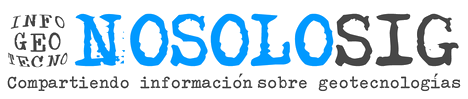
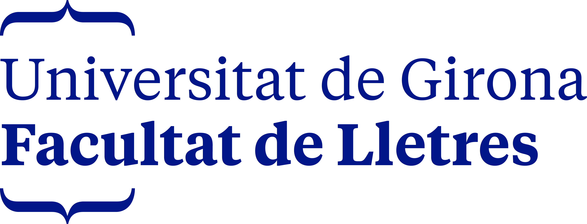

# 18as Jornadas de SIG libre (2025)

Las tecnologías de la información geográfica se actualizan a una velocidad sin precedentes. Cada vez más, nuevas herramientas salen a la luz para facilitar nuestro día a día y aumenta la demanda de perfiles más técnicos como el *Spatial Data Scientist*. Las Jornadas de SIG Libre son un evento donde se congrega a todo el sector *Geotech* para discutir y aprender de las nuevas tendencias de nuestro ámbito.

Este año, los temas que se han abordado son la visualización de datos, el análisis espacial, el desarrollo de *software* y aplicaciones, *webmapping*, observación de la Tierra, ciencia de datos, geoestadística, *machine learning*, datos abiertos, etc.

* 17-18 de septiembre de 2025
* Facultat de Lletres i de Turisme, Universitat de Girona y Hotel Carlemany Girona

Sesión inaugural
==================

* **Presentación y apertura** Gemma Boix (Directora del SIGTE-Universitat de Girona). **[Vídeo](https://bibstream.udg.edu/streaming/8224.mp4)**

Ponencias plenarias
====================

* **Turismo 404: Algoritmos para un turismo inteligente** José Antonio Donaire.  **[Vídeo](https://diobma.udg.edu/handle/10256.1/8214)**
* **¿Quién paga tus facturas? Sostenibilidad, comunidad y negocio: el triángulo del software libre** Marco Bernasocchi (QField), **[Vídeo](https://diobma.udg.edu/handle/10256.1/8225)**

Lightning talks 
=================

* **Fina e os mapas** Pablo Sanxiao. | **[Vídeo](https://diobma.udg.edu/handle/10256.1/8226)**
* **¿OSM y Administración Pública? Sí, se puede (II parte)** José Manuel Vázquez López. **[Presentación](data/pdf/lightning_talks/2_presentacion_JSL_JVL_2025.pdf)** | **[Vídeo](https://diobma.udg.edu/handle/10256.1/8227)**
* **Desarrollo de aplicaciones de teledetección con el uso de métodos predictivos para la mejora de los resultados para aplicaciones forestales** Estela Llorente. **[Presentación](data/pdf/lightning_talks/3_estela.pdf)** | **[Vídeo](https://diobma.udg.edu/handle/10256.1/8228)**
* **Environmental Justice Atlas, un visor libre para conflictos ambientales** Miguel García Coya (Geomatico). **[Presentación](data/pdf/lightning_talks/4_ejatlas.pdf)** | **[Vídeo](https://diobma.udg.edu/handle/10256.1/8229)**
* **Relojes de arena polinómicos**  Iván Sánchez Ortega, Javier Jimenez Shaw **[Presentación](data/pdf/lightning_talks/5_relojes.pdf)** | **[Vídeo](https://diobma.udg.edu/handle/10256.1/8230)**
* **SIG Corporativo de la Junta de Andalucía (SIGCJA): 18 años de éxito** Emilio Pardo Pérez (Guadaltel), Daniel Luna Rodríguez (Guadaltel), Jose Antonio Moreno (Instituto de Estadística y Cartografía de Andalucía), Borja Mañas (Instituto de Estadística y Cartografía de Andalucía).
**[Presentación](data/pdf/lightning_talks/6_sig_corporativo_junta_andalucia.pdf)** | **[Vídeo](https://diobma.udg.edu/handle/10256.1/8231)**
* **SPAI Chat: Mejora de la usabilidad de datos complejos mediante LLMs para la gestión del riesgo de deslizamiento** Fran Martín (Earthpulse).
 **[Presentación](data/pdf/lightning_talks/7_spai_chat.pdf)** | **[Vídeo](https://diobma.udg.edu/handle/10256.1/8238)**
* **Casos de éxito en ingeniería de redes eléctricas con software libre** Miquel Febrer Martínez (Geoinnova). **[Presentación](data/pdf/lightning_talks/8_MFM_casos_exito.pdf)** | **[Vídeo](https://diobma.udg.edu/handle/10256.1/8239)**
* **Estimación de la humedad del suelo en frutales a partir de banda L y banda C de SAR y aprendizaje automático**Mireia Gòdia Martí
 **[Presentación](data/pdf/lightning_talks/9_estimacion_humedad.pdf)** | **[Vídeo](https://diobma.udg.edu/handle/10256.1/8242)**
* **Edusat Challenge** Rosa Olivella (SIGTE). **[Presentación] (data/pdf/lightning_talks/10_edusat.pdf)** | **[Vídeo](https://diobma.udg.edu/handle/10256.1/8240)**
* **Accediendo a OvertureMaps de forma directa desde GeoServer**Jose Macchi, Ariel Anthieni. **[Presentación](data/pdf/lightning_talks/11_overture_maps.pdf)** | **[Vídeo](https://diobma.udg.edu/handle/10256.1/8216)**
* **Sensores remotos aplicados a la conservación de macroalgas** Carlos García Lanchares (URJC), Rosa María Chefoui (URJC), Rosa María Viejo (URJC), Julio Arrontes (uniovi), José Luis Acuña (uniovi). **[Presentación](data/pdf/lightning_talks/12_sensores_remotos.pdf)** | **[Vídeo](https://diobma.udg.edu/handle/10256.1/8241)**
* **Ecosistema europeo de la tecnología geoespacial optimizada para la nube (Cloud Native Geospatial)** Félix Pedrera (Indra Deimos).
 **[Presentación](data/pdf/lightning_talks/13_ecosistema_europeo.pdf)** | **[Vídeo](https://diobma.udg.edu/handle/10256.1/8207)**
* **Mapas de biodiversidad y estándares: del archivo al dato vivo** Marti Pericay (Geomatico).
 **[Presentación](data/pdf/lightning_talks/14_presentacion_Geomatico.pdf)** | **[Vídeo](https://diobma.udg.edu/handle/10256.1/8208)**
* **Quick Web Viewer: Publicar mapas online con QGIS y MapLibre** Gerald Kogler (trescientosmil)
. **[Presentación](data/pdf/lightning_talks/15_QWV.pdf)** | **[Vídeo](https://diobma.udg.edu/handle/10256.1/8209)**
* **Una nueva infraestructura compartida para las comunidades de geoinquietos al estilo DIWO (Do It With Others)** Francisco Pérez Sampayo (Geomatico), Jorge Sanz (Osgeo) **[Presentación](data/pdf/lightning_talks/16_geoinquietos_lightningtalk.pdf)** | **[Vídeo](https://diobma.udg.edu/handle/10256.1/8210)**

Comunicaciones
---------------------------

* **¿Cuánto sol tiene tu tejado? GIS para el autoconsumo energético** Alfonso Martínez (Guadaltel), Celia Sevilla (CNIG), Pablo Domingo (CNIG), Sonia Lara (Ministerio de transportes), Pedro Martin (CNIG), Aurelio Aragón (CNIG)
. **[Presentación](data/pdf/comunicaciones/Aula_C1/Potencial_solar.pdf)** | **[Vídeo](https://diobma.udg.edu/handle/10256.1/8211)**
* **Testing avanzado en PostgreSQL con pgTAP e integración continua en Github aplicado a Giswater** Daniel Martín (BGEO). **[Presentación](data/pdf/comunicaciones/Aula_C1/SIG_testing_giswater.pdf)** | **[Vídeo](https://diobma.udg.edu/handle/10256.1/8212)**
* **Frenesí de nuevas funciones de Gleo** Iván Sánchez. **[Vídeo](https://diobma.udg.edu/handle/10256.1/8213)**
* **FLUENT: predicción de fugas de agua utilizando IA, LEYP y regresión logística. Procesamiento de datos mediante PostgreSQL** Maria Guzmán (BGEO). **[Presentación](data/pdf/comunicaciones/Aula_C1/fluent2.pptx)** | **[Vídeo](https://diobma.udg.edu/handle/10256.1/8215)**
* **Visor Menut** Marc Roca (ICGC). **[Presentación](data/pdf/comunicaciones/Aula_C2/Menut_Siglliure.pdf)** | **[Vídeo](https://diobma.udg.edu/handle/10256.1/8217)**
* **Dashboard del consumo energético de los datacenters** Miquel Feixas (UdG), Anton Bardera (UdG). | **[Vídeo](https://diobma.udg.edu/handle/10256.1/8218)**
* **Catálogo de datos litológicos con GeoServer**  Josep Sitjar (SIGTE). **[Presentación](data/pdf/comunicaciones/Aula_C2/SIGTE_JSL2025_Roques.pdf)** | **[Vídeo](https://diobma.udg.edu/handle/10256.1/8219)**
* **Evolución y mejora de los mapas de calidad del aire de Barcelona** Javier Casado (Ajuntament Barcelona), Laia Igual (Nexus Geographics), Lluís Tartera (Nexus Geographics). **[Presentación](data/pdf/comunicaciones/Aula_C2/Nexus.pdf)** | **[Vídeo](https://diobma.udg.edu/handle/10256.1/8220)**
* **Estadísticas globales de usos agrícolas en Europa con Sentinel e IA en Eurostat** Emilio Pardo (Guadaltel), Alfonso Martínez (Guadaltel), Enrique Soriano (Guadaltel). **[Presentación](data/pdf/comunicaciones/Aula_C3/Eurostat.pdf)** | **[Vídeo](https://diobma.udg.edu/handle/10256.1/8221)**
* **Integración de un sistema de catalogación de recursos georreferenciados y un servidor de datos geoespaciales con una herramienta de gestión de identidad y acceso** Daniel Boubeta (Avansig), Alberto Pérez (Avansig), Javier Bandariz (Avansig), Sergio Rodríguez (Avansig). **[Vídeo](https://diobma.udg.edu/handle/10256.1/8234)**
* **STAC en la aerofototeca del Ayuntamiento de Roma** Luigi Pirelli. **[Vídeo](https://diobma.udg.edu/handle/10256.1/8233)** 
* **El gemelo digital no es un holograma: son unos buenos datasetsG** Emilio Pardo (Guadaltel), Alfonso Martínez (Guadaltel), Enrique Soriano (Guadaltel). **[Presentación](data/pdf/comunicaciones/Aula_C3/Gemelo_Digital.pdf)** |**[Vídeo](https://diobma.udg.edu/handle/10256.1/8247)**

Talleres
========

* **Taller 1: Crear un catálogo STAC de imágenes en Python desde cero** Luigi Pirelli. **[Presentación](data/pdf/workshops/catalogoStac(Luigi).zip)**
* **Taller 2: Entrenamiento de modelos de IA con datos de observación terrestre con SCANEO, EOTDL y PyTorchEO** Fran Martín (Earthpulse). **[Presentación](data/pdf/workshops/SCANEO.zip)**
* **Taller 3: Despliegue y personalización de QGIS Web Client 2: extendiendo QWC2 con servicios extra y plugins personalizados** Jordi Blanch (BGEO), Edgar Fusté (BGEO). 
* **Taller 4: Plataforma GeoNode: gestión y visualización integral de datos espaciales en web** Patricio Soriano (Geoinnova).
* **Taller 5: Instalación de la plataforma SITMUN y configuración de un visualizador web** Marc Rosès (Silme), Francisco Javier (Unizar), Ricard Cots (cime). 
* **Taller 6: Automatización del procesamiento de normalización de imágenes Landsat y obtención de productos derivados: un protocolo abierto y reproducible** Diego García (CSIC).  **[Presentación](data/pdf/workshops/Landsat.pdf)**
* **Taller 7: Haz un mapa web interactivo con tres líneas de código en R** Josep Pueyo-Ros (UdG). 
* **Taller 8: Exploración de técnicas de representación cartográfica: 5 maneras de hacer un mapa** Lluís Vicens (SIGTE - Universitat de Girona) **[Presentación](https://bitbucket.org/sigte/taller_dataviz_siglibre2025/src/main/)**. 
* **Taller 9: Análisis y visualización con Elasticsearch y Kibana** Jorge Sanz (Elastic).  **[Presentación](data/pdf/workshops/kibana.txt)**. 
* **Taller 10: API-IDEE 3D: descubre cómo llevar tu visualizador cartográfico al siguiente nivel** Aurelio Aragón (CNIG), Eduardo Castilla (Junta de Andalucía).  **[Presentación](data/pdf/workshops/Taller_api_idee.zip)**. 

Comunicaciones
---------------------------

* **Ha nacido una estrella: API-IDEE. Convergencia y fusión de API para una Administración más eficiente** Aurelio Aragón (CNIG), Eduardo Castilla (Junta de Andalucía). **[Presentación](data/pdf/comunicaciones/Aula_A1/Presentacion_API-IDEE.pdf)** | **[Vídeo](https://diobma.udg.edu/handle/10256.1/8232)**
* **Publicación en abierto de datos analíticos en Girona: Nuevo observatorio de datos con Enterprise Data Analytics** Jordi Xirgo (Aj. Girona), Juanjo Ortilles, Blanca Domenech (Aj. Girona), Mònica Serra (Aj. Girona), Francesc Puigvert (Aj. Girona). **[Presentación](data/pdf/comunicaciones/Aula_A1/presentacion_observatori.pdf)** | **[Vídeo](https://diobma.udg.edu/handle/10256.1/8250)**
* **Normalizando para conectar GIS y BIM** Montserrat Monteagudo (AMB). **[Presentación](data/pdf/comunicaciones/Aula_A1/SIG_Lliure_Girona_2025_Normalizando_GIS_BIM.pdf)** | **[Vídeo](https://diobma.udg.edu/handle/10256.1/8235)**
* **SITMUN. Soporte mutuo y reutilización** Ricard Cots (Cime), Gemma Peix (DDGI). **[Presentación](data/pdf/comunicaciones/Aula_A1/2025_SITMUN_Presentacion_Jornadas_SIG_Libre.pdf)** | **[Vídeo](https://diobma.udg.edu/handle/10256.1/8245)**
* **QSITNA, el GIS corporativo del Gobierno de Navarra**Unai Gómez (Tracasa), Raúl Estévez (Tracasa). **[Presentación](data/pdf/comunicaciones/Aula_A1/presentacion_JSL_QSITNA.pdf)** | **[Vídeo](https://diobma.udg.edu/handle/10256.1/8236)**
* **Mapeado de etimología de calles mediante el uso de datos enlazados OpenStreetMap ↔ Wikidata** Miguel Sevilla. 
* **El ecosistema de R para OpenStreetMap: herramientas disponibles y aplicaciones para el monitoreo del mapa colaborativo** Joan Maspons, Marc Bosc.  
* **GIS sí, pero con sentidiño** Pablo Sanxiao (iCarto).
* **Servicio de geolocalización de ámbito nacional y código abierto**Itziar Doñate (CNIG), Óscar A. Cano (CNIG), Sergio Ayuso (CNIG), José María (CNIG), Paloma Abad (CNIG). **[Presentación](data/pdf/comunicaciones/Aula_A2/Presentacion_JSL_Itziar_Doñate_Vadillo_v2.pdf)**

* **Todo lo que (no) siempre quisiste saber de licencias de IA (para SIG), pero (realmente) no te atreviste a preguntar** Malcolm Bain (Acrosslegal). **[Presentación](data/pdf/comunicaciones/Aula_A7/AI_Licensing_GIS_Presentation_2.pdf)** 
* **Inteligencia artificial al servicio de los mapas: democratizando la información geoespacial con LLMs** Alfonso Martínez (Guadaltel). 
* **Detectando lo indetectable: deep learning y GIS para localizar sismos de baja intensidad** Alfonso Martínez (Guadaltel). **[Presentación](data/pdf/comunicaciones/Aula_A7/Terremotos.pdf)** 
* **Videowall inteligente para la gestión dinámica de las operaciones marítimas en el Puerto de Barcelona** Francesc Xavier Valls (Port de Barcelona), Andrés Vallejo (Nexus Geographics), Francesc Rosas (Nexus Geographics), Lluis Tartera (Nexus Geographics). **[Presentación](data/pdf/comunicaciones/Aula_A7/PresentacióVideowall_SIG_LLiure_2.pdf)** 
* **Diseño de un algoritmo de búsqueda espacial multiobjetivo y desarrollo de una herramienta web SIG para proyectos de reestructuración parcelaria** Ismael López (Avansig), Sergio Rodríguez (Avansig), Francisco Javier Ferrer (Xunta de Galicia), Francisco José Tomico (Xunta de Galicia), Daniel Boubeta (Avansig), Mateo Díaz (Avansig), David Torea (Xunta de Galicia), Carlos Díaz (Xunta de Galicia). **[Presentación](data/pdf/comunicaciones/Aula_A7/presentacion_JSL_reparc.pdf)** 

Patrocinadores
==============

 

 

 

 

 

 

 

 

Colaboradores
==============

 

 

 

 

 

 

 

 

 

 

